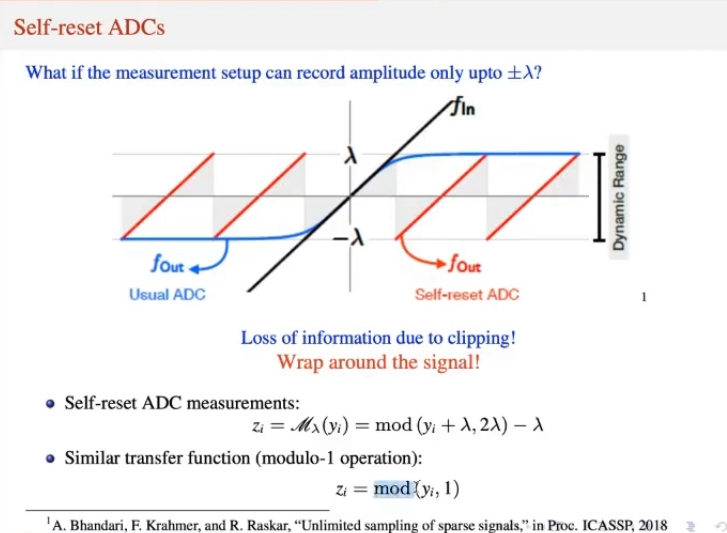

## Compressed Sensing

Recover a high dimensional vector $x$ with a very few non-zero values. 
 - $$Supp(x) \leq k << N$$.
 - Plethora of algorithms

### Sensors and Measurements
 - Sensors have Finite Dynamic Range 
 - $$ \text{dynamic range} = 20\log(\frac{\text{ADC range}}{\text{Step size}}) = 20\log(\frac{2\lambda}{ \delta}) $$ 
 - Loss of information due to clipping. One potential approach to fix this is to wrap around the signal.

   ​

This is where Modulo comes in. 

### Why can't we scale the signal?

There is an inherent quantization step involved during measurements. Therefore, scaling down and scaling back up will have the same resolution. 

- Quantization error is proportional to the maximum value of the input signal.

# Modulo Compressed Sensing

Typically, the real world sensors have a **finite** dynamic range. They have a **clipping** effect where the measurements become **saturated** once the values cross the range of the sensor. High dynamic range systems are affected by *high quantization noise*. To counter this problem, a new approach for measurements called **self-reset analog to deigital converters (SR-ADCs)** have been proposed.

These sensors fold the amplitudes back into the dynamic range of the ADCs using the modulo arithmetic. However, these systems encounter loss due to the modulo operation. The *transfer* function of the SR_ADC with parameter $$\lambda$$ is given by
$$
\mathcal M_\lambda = 2\lambda \left( \left[ \left[ \frac{t}{2\lambda} + \frac{1}{2} \right]\right] - \frac{1}{2}\right)
$$
