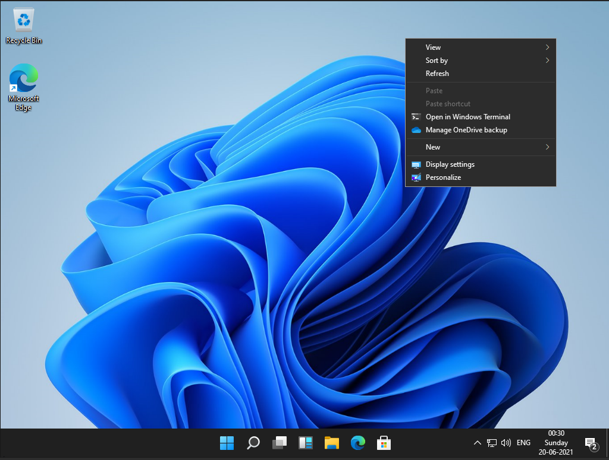
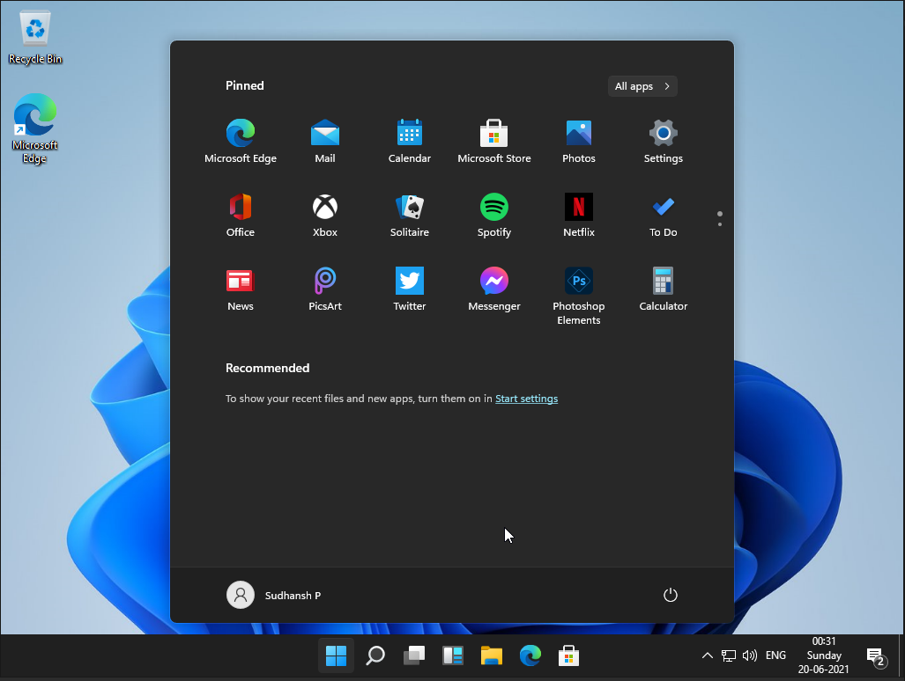
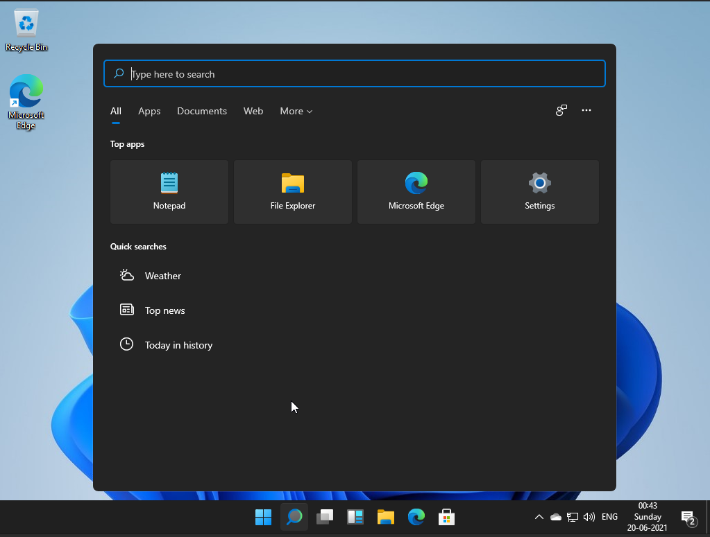
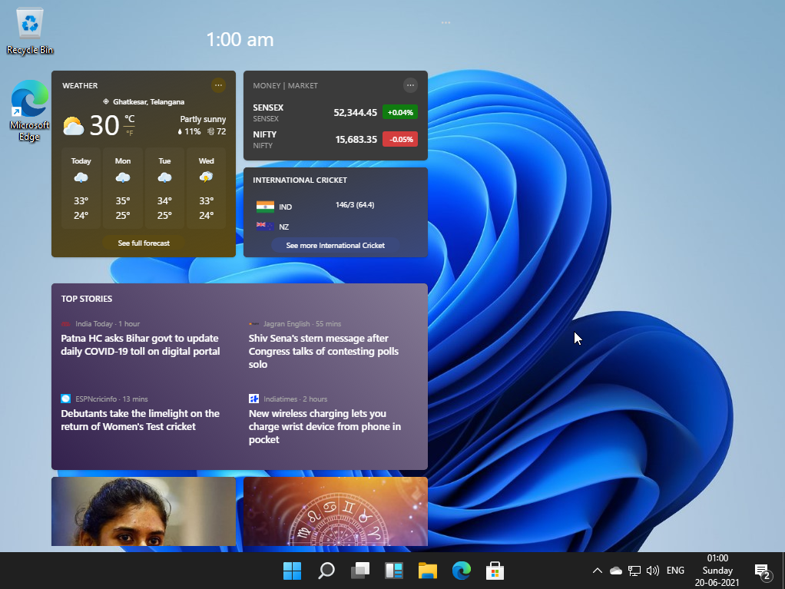
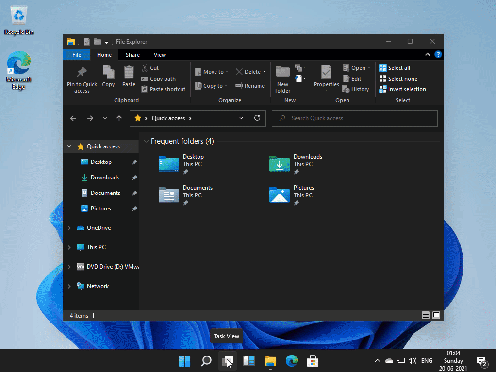
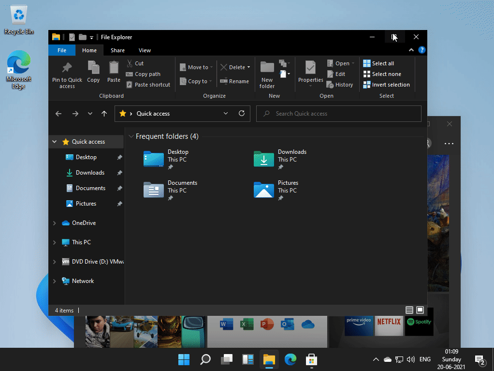
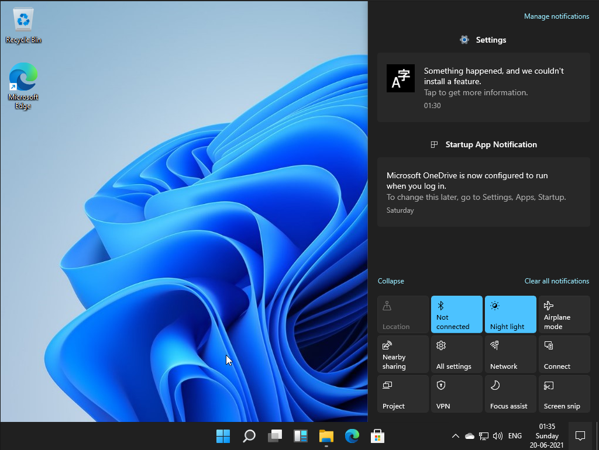
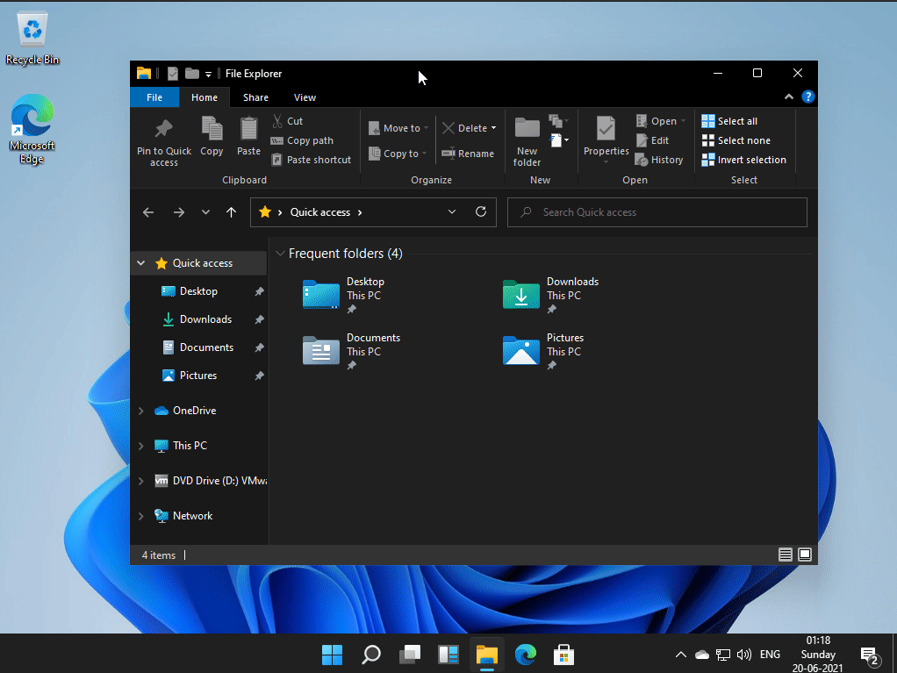
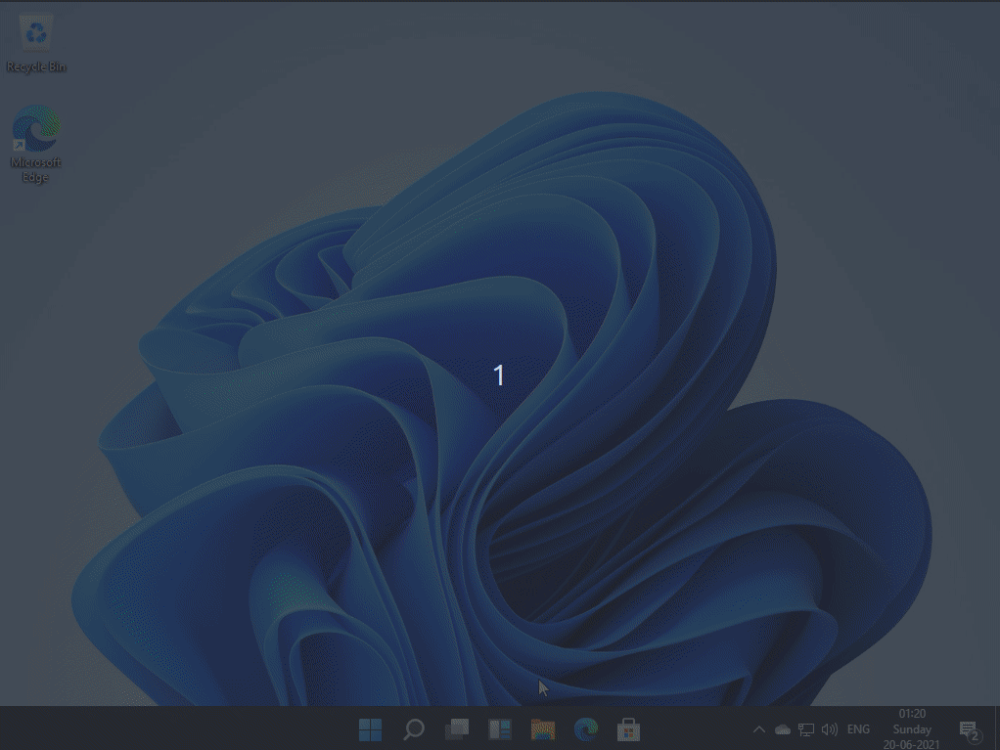
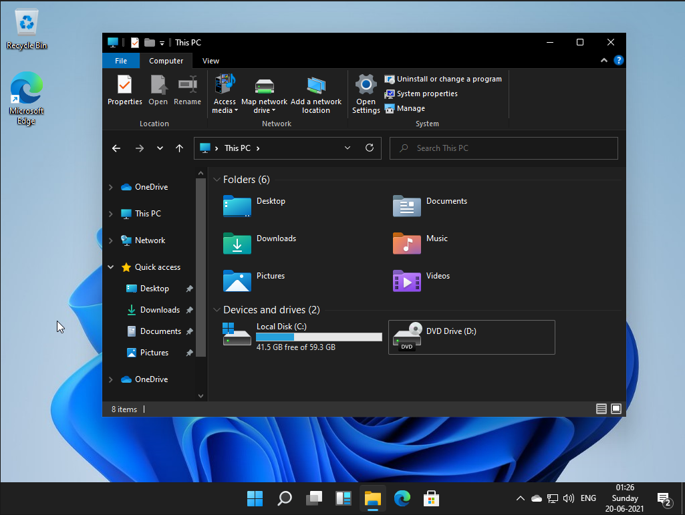

With the new windows 11 event right around the corner, many leaks have surfaced over the internet. One can find a developer edition of Windows 11 anywhere online. This is a brief review of one such edition. Windows 11 will be officially announced on June 24th.

 Right off the bat, you will notice the sleek new design of the OS. Although, the design is not completely overhauled, there are subtle animation and design changes which give windows 11 a refreshed new look. 

# Taskbar and Start Menu

The new centered layout of the taskbar is the first thing that one notices that's new in Windows 11. The start button has stayed on the left until Windows 10 (except Windows 8) and this is a very contentious topic. The last time Microsoft made a major change to the start menu (yes, I'm talking about Windows 8), it faced discontent from the users and critics alike. However, this time around, the major functionality of the start menu is the same and the design has changed outstandingly. 

The design pretty much looks like the deprecated OS, windows 10X. Microsoft had been working on an operating system for dual-screen devices before cancelling this project. The central arrangement of the taskbar is reminiscent of the MacOS dock. I, for one, prefer the original taskbar alignment. 

You can revert back to left alignment of taskbar in settings. Other than this, the taskbar has refreshed icons, a new start button and menu, and on click animations to the buttons.

There are some major changes to the start menu in Windows 11. Previously, it contained a long list off apps with live tiles (a beloved feature from Windows 8). Microsoft does away with this layout and replaces it with pinned and recommended apps. Therefore, the start menu now looks much simpler and easier to use. The start menu hovers over the taskbar and has rounded corners (again, something abundantly found in MacOS).

## Search

This developer version of Windows 11 does not have Cortana. According to recent articles, [Cortana denies the existence of Windows 11](https://www.windowscentral.com/microsofts-cortana-denies-existence-windows-11). There aren't any major changes to search interface other than the design. It has the similar 'hover' and 'rounded-corners' like the start menu.

## Widgets

The new icon to the left of the file explorer on the taskbar is "Widgets". Widgets are making a return from Windows Vista but with much more cleaner interface. Similar to iOS, the widgets are arranged in tiles and each tile gives look-at-glance updates and information.

## Multitasking and virtual desktops

Using virtual desktops is much more natural in Windows 11. You can change the background of individual desktops, and slide through the different desktops using touch and mouse. 

Multitasking gets a whole lot better on Windows 11. Many users work on multiple tasks using 'split-view' on Windows. Microsoft makes it easy to work with multiple windows using the new "groups" feature. When you hover over the maximize button of a window, you will notice 4 layouts to arrange multiple windows in. You can create a group of windows and Windows will remember that for later use.

## Action Menu

The action menu has the consistent rounded-corners design. It has bigger icons and bigger slider icons. This does not look like a big change for non-touch users but it's invigorating for touch users. The buttons and other options feel right at the fingertips in the new design.

# Animations and Aero Theme

Windows vista and Windows 7 sported the Aero theme which gave a glass-like effect to windows and fancy effects to tiled apps. Microsoft dampened these effects in Windows 10, but they're back in Windows 11. Windows 11 has much more smoother animations. When you drag a window to an edge or a corner, a gray/glass-like background shows the new layout of the window.

 

The window transitions for minimize, maximize, close and open animations are also beautiful. The taskbar icons bounce when the window is minimized. All of these give the new Windows a contemporary look.

### Sounds

Windows 11 has a new set of sounds for frequently used tasks such as inserting USB drives, notifications, error messages, and more. Most of these sounds stayed pretty much the same in Windows 10, and it's refreshing to hear new sounds in Windows 11.

## File Explorer

As you might have noticed, the file explorer looks very different from the previous iterations. The icons have a colorful new look and they look even better in the new dark mode.

 

Most of these icons remained the same across all the operating systems till Windows 10. The new icons further help Microsoft develop a modern look for the new OS. There are new icons for Documents, Videos, Pictures, Downloads and much more which you will notice as you browse around.

# Conclusion

Microsoft is entering a new era with Windows 11. The developer version has limited features and quite many bugs. Nonetheless, tons of new features will be announced during the official release. Overall, the OS has a refreshing feel to it and promises a brand-new experience compared to Windows 10. 