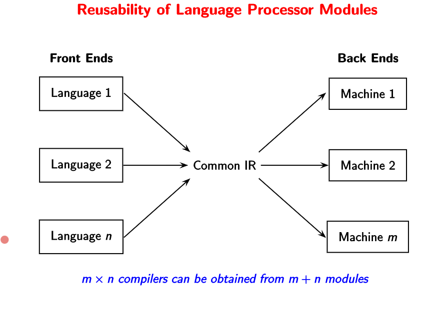

# Lecture 01

## Binding

Binding refers to finding certain attributes of certain objects. For example, when we consider the example of developing a program, we have the following steps.

At each step, the number of unbound objects decrease along with time.

## Implementation Mechanisms

The important point to note is that the "execution" is done after "translation" in the case of **compilers** (Analysis + Synthesis). However, **interpreters** (Analysis + Execution) themselves are programs which take the source code as input and translate/execute the user-program.

Compilers/Translators lower the level of the program specification, whereas the interpreters do the opposite. That is why interpreters are able to directly execute the source code.

> Why is the arrow in the reverse direction? Think of python. The python program itself is a low-level code which is able to execute a high-level user code. 

| High Level   | Low Level          |
| ------------ | ------------------ |
| C statements | Assembly statement |

**Note.** A practical interpreter does partial translation/compilation but not completely as it is redundant.

> Compilers performs bindings **before** runtime, and an interpreter performs bindings **at** runtime.

> Why interpreters if compilers are fast? Compilers are used for programs which need to be executed multiple times with speed. However, we must also consider the time needed to compiler the codes in case of compilers. Considering this, the turnaround time in both cases is almost the same. The user needs to think whether they want to reduce the execution time or reduce the turnaround time.

| Language | Mode of execution      |
| -------- | ---------------------- |
| C++      | Compiler               |
| Java/ C# | Compiler + Interpreter |
| Python   | Interpreter            |

Java programs run on a *virtual machine* - JIT (just in time) compilation. the virtual machine invokes a native compiler for instances of code which are repeated often inside the code. This speeds up the execution in case of Java. 

Compilers like GCC can be used for multiple machines and languages. 

## Simple compiler

The first step in the translation sequence of the compiler is **scanning and parsing**. A parse-tree is built from the <u>grammar rules, terminals, and non-terminals</u>. Scanning involves finding special characters to create the parse tree, whereas parsing is essentially creating the parse tree itself.

The next step involves **semantic analysis**. The semantic analyzer performs **type checking** to check the validity of the expressions. Therefore, we create an <u>abstract syntax tree</u> (**AST**) is created from the parse tree.

> Only for type-checking? Yes, that is the primary purpose, but it has other uses too. Sometimes, type checking is done on the fly while generating the parse tree itself. The advantage for generating the AST is that we can write a generic code (interpreter) to parse the abstract trees (since it involves only tokens).

Then, we generate a **TAC list** (three address code) in the **IR generation** step.  This step helps in separating data and control flow, and hence simplifies optimization. The control flow is linearized by flattening nested control constructs.

In the **Instruction Selection** step, we generate the **RTL list** which is like pseudo-assembly code with all the assembly instruction names. We try to generate as few instructions as possible using temporaries and local registers. 

> What is the purpose of this step? We like to divide the problem into many steps to leave room for optimization.

In the final step of **Emitting Instructions**, we generate the assembly code by converting the names of assembly instructions to the actual code.

The whole process is summarized by the following image.

## Observations

A compiler bridges the gap between source program and target program. Compilation involves gradual lowering of levels of the IR of an input program. The design of the IRs is the most critical part of a compiler design. Practical compilers are desired to be retargetable.