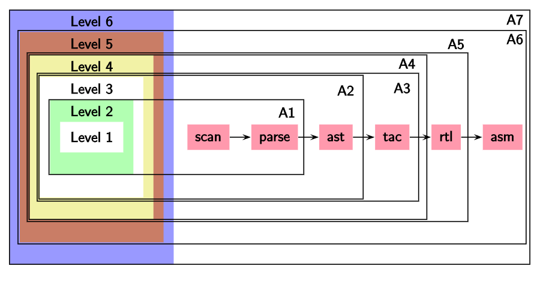

# Lecture 02

> `07-01-22`

Write about retargetable compilers. A **retargetable compiler** does not require manual changes, the backend is generated according to the specifications.

## Why are compilers relevant today?

In the present age, very few people write compilers. However, translation and interpretation are fundamental to CS at a conceptual level. It helps us understand stepwise refinement - building layers of abstractions and bridging the gaps between successive layers without performance penalties. Also, knowing compilers internals makes a person a much better programmer.

## Modularity of Compilation

A compiler works in phases to map source features to target features. We divide each feature into multiple levels for convenience. This will be clear through the assignments (language increments).

## Course Plan

We shall cover scanning, parsing, static semantics, runtime support, and code generations in the theory course. In the lab course, we shall do incremental construction of SCLP.

