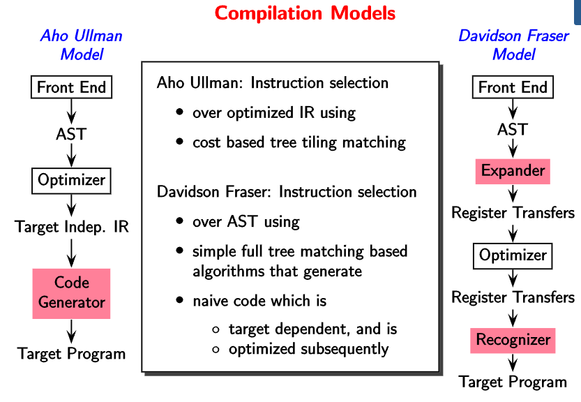

# Lecture 3

> `12-01-22`

## Compilation Models

Registers are introduced earlier in the Davidson Fraser model. Therefore, it becomes machine dependent. The target independent IR in `gcc` is called ‘gimple’.

### Typical Front ends

How does a front end work? Usually, the *parser* calls the *scanner* that reads the source program to extract **tokens**. These tokens are then used by the parser to create the parse tree. We can say that the scanner is a subordinate routine of the parser. On the other side, the parser sends the parse tree to the *semantic analyzer* which generates the AST. Finally, we get the AST/ Linear IR along with a symbol table.

### Typical Back ends in Aho Ullman Model

The backend receives the machine independent IR from the front end. It then proceeds to optimize the instructions via compile time evaluations and elimination of redundant computations. There are techniques such as constant propagation and dead-code elimination that are used.

After optimization, the code generator converts the machine independent IR to machine dependent IR. The essential operations done by the code generator are instruction selection, local register allocation, and the choice of order of evaluation.

Finally, we have the machine dependent optimizer which outputs assembly code. It involves register allocators, instruction schedulers and peephole optimizer.

### GNU Tool Chain for C

We know that the `gcc` compiler take source program as input and produces a target program. Internally, this is done via a compiler called 'cc1' (C compiler 1) which generates the assembly program. This assembly code is taken by the assembly component of the compiler to generate an object file. Finally, the loader takes this object file along with `glibc/newlib` to generate the target program. The assembly program and loader together are known as **`binutils`**.

### LLVM Tool Chain for C

The LLVM tool chain looks similar to the GNU tool chain. We have `clang -cc1`, `clang -E`, `llvm-as` (assembly program) and `lld`(loader). The re-targetability mechanism is done via table generation code.

## Modern Challenges

Currently, most of the implementation of compilers has been more or less done. What is left? Some applications and architectures demand special programming languages and compilers that are *non-standard*. Also, there are some design issues with compilers. It is the IR that breaks or makes a compiler. Including these there are many places of optimization such as 

- Scaling analysis to large programs without losing precision
- Increasing the precision of analysis
- Combining static and dynamic analysis.

*Full Employment Guarantee Theorem for Compiler Writers*.

- Software view is stable, hardware view is disruptive.
- Correctness of optimizations
- Interference with security
- Compiler verification and Translation Validation
- Machine Learning?
- $$\dots$$

## ~ Lexical Analysis 

## Scanners

To discover the structure of the program, we first get a sequence of **lexemes** or **tokens** using the smallest meaningful units. Once this is done, we remove spaces and other whitespace characters in the **lexical analysis** or **scanning** step.

In the second step, we group the lexemes to form larger structures (parse tree). This is called as **syntax analysis** or **parsing**. There are tools like `Antlr` that combine scanning with parsing.

### Lexemes, Tokens, and Patterns

***Definition.*** *Lexical Analysis* is the operation of dividing the input program into a sequence of lexemes (tokens). **Lexemes** are the smallest logical units (words) of a program. Whereas, **tokens** are sets of similar lexemes, i.e. lexemes which have a common syntactic description.

How are tokens and lexemes decided? What is the basis for grouping lexemes into tokens? Generally, lexemes which play similar roles during syntax analysis are grouped into a common token. Each keyword plays a different role and are therefore a token by themselves. Each punctuation symbol and each delimiter is a token by itself All comments are uniformly ignored and hence are grouped under the same token. All identifiers (names) are grouped in a common token. 

Lexemes such as comments and white spaces are not passed to the later stages of a compiler. These have to be detected and ignored. Apart from the token itself, the lexical analyzer also passes other information regarding the token. These items of information are called **token attributes**. 

In conclusion, the lexical analyzer

- Detects the next lexeme
- Categorizes it into the right oken
- Passes to the syntax analyzer. The token name for further syntax analysis and the lexeme itself.
