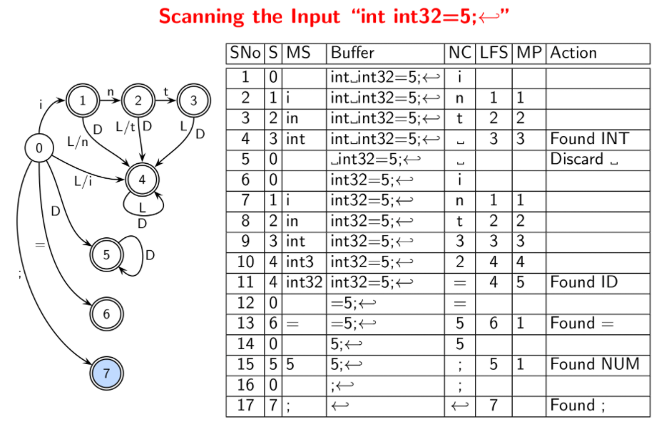

# Lecture 5 

> `21-01-22`

## Tokenizing the input using DFAs

The format to show a trace of scanning is given by

| Step No | State | Matched String | Buffer | `NextChar` | `LastFinalState` | `MarkedPos` | Action |
| ------- | ----- | -------------- | ------ | ---------- | ---------------- | ----------- | ------ |

Here, `MatchedString` is the prefix of the buffer matched to identify a lexeme. `NextChar` is the next character in the input; it will be shifted to the buffer if there is a valid transition in the DFA. `MarkedPos` is the position of the character (in the buffer) just after the last seen lexeme. The important point to note is that when there is no transition on `Nextchar`,

- if `MarkedPos` is -1, no final state was seen, the first character in the buffer is discarded, and the second character becomes `NextChar`.
- otherwise, the lexeme up to `MarkedPos` (excluding it) is returned, the character at `MarkedPos` becomes `NextChar`.

In either case, the `LastFinalState` is set to -1 and the state is set to 0. See the following example for clarity.



This sort of parsing has quadratic behavior in the worst case. Consider the following two questions.

- Is $$S$$ always equal to `LastFinalState`?
- Is `MP` always equal to the length of the last lexeme?

The answer to both questions is “No”. Think.

## ~ Introduction to Parsing using Lex/Flex and Yacc/Bison

Lex is a program that takes regular expressions as input and generates a scanner code. A Lex script can be decoded as follows. It has three parts separated by “%%”.

- The first part consists of declarations. These are copied to `lex.yy.c` and are contained in the pair “%{” and “%}”. Declarations outside of this pair are directives to lex or macros to be used in regular expressions.
- The second part consists of rules and actions. These are basically a sequence of “Regex SPACE Action” lines.
- Finally, the third part consists of auxiliary code.

Yacc is a program that takes tokens from the scanner and parses them. A yacc script is very similar to that of lex. It has three parts which are separated by “%%”.

- The first part has declarations that are to be copied to `y.tab.c` contained in the pair “%{” and “%}”. Declarations outside of this pair are directives to yacc or specifications of tokens, types of values of grammar symbol, precedence, associativity etc.
- The second part has rules and actions. That is, a sequence of grammar productions and actions.
- The last part has the auxiliary code.

The yacc and lex scripts are combined together using gcc. The typical workflow is 

```bash
yacc -dv <file-name>.y
gcc -c y.tab.c
lex <file-name>.l
gcc -c lex.yy.c
gcc -o <obj-file-name> lex.yy.o y.tab.o -ly -ll
```

