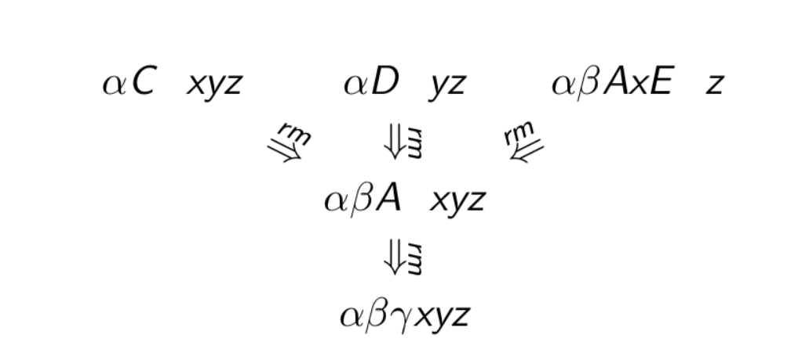

# Lecture 9

> `09-02-22`

### Properties of shift-reduce parsers

Is the following situation possible?

- $$\alpha \beta \gamma$$ is the stack content, and $$A\to \gamma$$ is the handle.
- The stack content reduces to $$\alpha \beta A$$
- Now, $$B \to \beta$$ in the next handle.

Notice that the handle is buried in the stack. The search for the handle can be expensive. If this is true, then there is a sequence of rightmost derivations 

$$
S \xrightarrow{*rm} \alpha BAxyz \xrightarrow{rm} \alpha \beta Axyz \xrightarrow{rm} \alpha \beta \gamma xyz
$$

However, this is not a valid rightmost derivation. Therefore, the above scenario is not possible.

This property does not ensure unique reductions with SR parser. For example, we can have the following.

These problems are collectively grouped as shift-reduce conflicts and reduce-reduce conflicts. Given a parsing table, each (state, char) pair can have two possible valid actions. These conflicts are resolved by conventionally choosing one action over the other.

## Simple Right to Left Parsing (SLR(1))

Shift reduce parsing is a precursor to this parsing method. As in, shift reduce parsing does not have a definitive algorithm as such, and it is formalized using SLR parsing.

### Shift Reduce Parsing: Formal Algorithms

`TODO`

