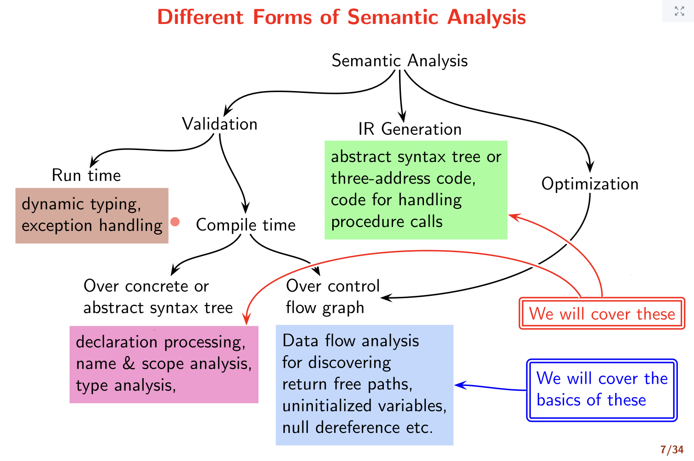

# Lecture 13

> `02-03-22`

## Why separate semantic analysis from syntax analysis?

The constraints that define semantic validity cannot be described by context free grammars. Also, using context sensitive grammars for parsing is expensive. Practical compilers use CFGs to admit a superset of valid sentences and prune out invalid sentences by imposing context sensitive restrictions. For example, $$\{wcw \mid w \in \Sigma^*\}$$ is not a CFG. We accept all sentences in $$\{xcy \mid x, y \in \Sigma^*\}$$, enter $$x$$ in a symbol table during declaration processing, and when ‘variable uses’ are processed, lookup the symbol table and check if $$y = x$$.

We identify some attributes of the context-free grammar, and apply some constraints on them to simulate context-sensitivity.

### Terminology

- **Undefined behaviour** - Unchecked prohibited behaviour flagged by the language. These are not a responsibility of the compiler or its run time support. They have unpredictable outcomes, and the compiler is legally free to do anything. Practical compilers try to detect these and issue warnings (not errors).
- **Unspecified behaviour** (aka implementation-defined behaviour) - These refer to a valid feature whose implementation is left to the compiler. The available choices do no affect the result by mat influence the efficiency. For example, the order of evaluation of subexpressions is chosen by the compiler. Practical compilers make choices based on well defined criteria,
- **Exceptions** - Prohibited behaviour checked by the runtime support. Practical compilers try to detect these at compile time.

## Different forms of Semantic Analysis

## Syntax Directed Definitions (SDDs)

The augmented CFG with attributes is given by 

| $$A \to \alpha $$ | $$b = f(c_1, c_2, \dots, c_k)$$ |
| ----------------- | ------------------------------- |

where $$b$$ is an attribute of $$A$$ and $$c_i$$, $$1 \leq i \leq k$$ are attributes of $$\alpha$$. These semantic rules are evaluated when the corresponding grammar tules is use for derivation/reduction.

**Note.** The associativity decision is not decided through the order of execution, but through the order in which variables are ‘seen’.