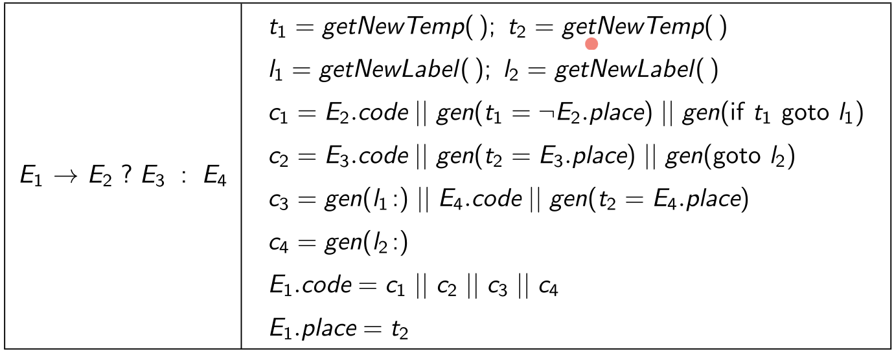

# Lecture 14

> `04-02-22`

## SDD for generating IR for expression

For example, consider the input statement $$x = (a - b) * ( c+ d) $$. The expected IR output is

```
t0 = a - b
t1 = c + d
t2 = t0 * t1
x = t2
```

To achieve this, we can have a “code” attribute for each `id`, and then concatenate the codes to obtain the IR.

Let us consider the example for generating an IR for a ternary expression. We have $$E_1 \to E_2\ ?\ E_3 : E_4$$. Then, we have the following template for the code of $$E_1$$.

```
E_2.code
t_1 = !E_2.place
if t_1 goto I_1
E_3.code
t_2 = E_3.place
goto I_2
I_1 : E_4.code
			t_2 = E_4.place
I_2 :
--------------------------
E_1.place = t_2
```

>Why are we using `!t1` instead of `t1`? It is just a design decision. 

Now, we shall use the following SDD for generating the above code.



There are two representations of a 2D array - row major representation and column major representation. FORTRAN uses column major representation for arrays. 

Should the compiler decide the representation or should the language do it? Languages specify the representation!

In general, we use row-major representation where the address of the cell $$(i, j)$$ is given by `base + i1*n2 + i2`. For a general $$k$$-D array, the offset is given by the recurrence


$$
\begin{align}
O_1 &= i_1 \\
O_{j + 1} &= O_j \times n_j + i_j
\end{align}
$$


We add the attributes `name, offset, ndim` etc for IR of array accesses.

Check the slides for the pseudocode to generate IR for unary/binary expressions, while loop etc. 

