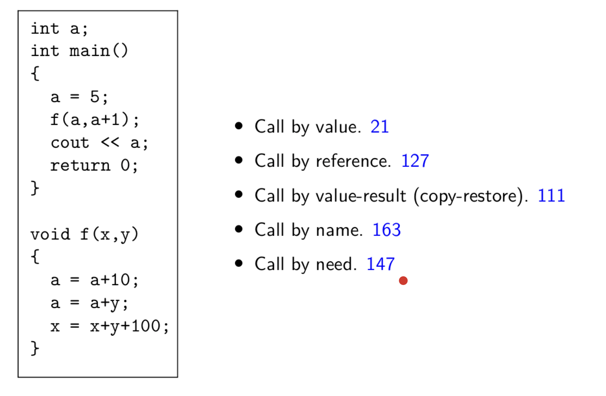

# Lecture 20

> `30-03-22`

## Using Static/Access Link

Let us reiterate the difference between static and dynamic scoping. In static scoping, we can use variables that are declared in the outer scope of the current scope. We use static/access link for this purpose. On the other hand, dynamic scoping follows the call chain for variables. We use control/dynamic link for this purpose. 

To access the activation record of a procedure at level $$l_1$$ from within a procedure at level $$l_2$$, we traverse the access link $$l_2 - l_1$$ times. Note that $$d_{callee} \leq d_{caller}+ 1$$.

## Parameter Passing Mechanisms

- **Call by value** - Copy the value of the actual parameter into the formal parameter. We use eager evaluation here. We do not know if the parameter is being used in the procedure, but we still evaluate it.
- **Call by reference** - Copy the address of the actual parameter into the formal parameter.
- **Call by value-result (copy-restore)** - Copy the value of the actual parameter and copy the final value of the formal parameter into the actual parameter. This method starts off with call by value. That is, the value of the actual parameter is copied into the formal parameter. However, in the end the value of the formal parameter that is evaluated inside the procedure is copied to the actual parameter. In the end we do `*(&e) = x` and not `e = x` because `e` is an expression.
- **Call by name** - Textural substitution of formal parameter by the actual parameter. Evaluation of the actual parameter is delayed until the value of formal parameter is used. The evaluation is done every time where the formal parameter is used in the procedure. So, this is equivalent to textual substitution or using a macro. All the modifications to the formal parameter is written to the address of the actual parameter. This is implemented by a **thunk** which is a parameterless procedure per actual argument to evaluate the expression and return the address of the evaluation.ccc
- **Call by need** - Textual substitution of formal parameter by the actual parameter but evaluation only once. This is similar to call by name but the evaluation of the actual parameter is done only at the first use. For any later use, we use the precomputed values. This is known as **lazy evaluation**.

We have the above to make the distinction between the different methods.

### Parameter Passing Mechanisms for Procedure as Parameters

Pass a closure of the procedure to be passed as parameter. A data structure containing a pair consisting of 

- A pointer to the procedure body

- A pointer to the external environment (i.e. the declarations of the non-local variables visible in the procedure)

  Depends on the scope rules (i.e., static or dynamic scope)

For C, there are no nested procedures so the environment is trivially global. So a closure is represented trivially by a function pointer. In C++, the environment of a class method consists of global declarations and the data members of the class. The environment can be identified from the class name of the receiver object of the method call.

### Representation of a Class

There is no distinction between the public and private data in memory. Public/Private is a compile time distinction. Every function with $$n$$ parameters is converted to a function of $$n + 1$$ parameter with the first parameter being the address the address of the object. Internally, the data space is separate for each object, but the code memory is same for all which contains the functions. 

### Virtual functions

Non-virtual functions are inherited much like data members. There is a single class-wide copy of the code and the address of the object is the first parameter as seen earlier. In the case of **virtual functions**, a pointer to a base class object may point to an object of any derived class in the class hierarchy.

### Virtual function resolution

Partially static and partially dynamic activity. At compile time, a compiler creates a virtual function table for each class. At runtime, a pointer may point to an object of any derived class, and the compiler-generated code is used to pick up the appropriate function by indexing into the virtual table for each class.

We define a **non-virtual function** as a function which is not virtual in *any* class in a hierarchy. Resolution of virtual functions depends on the class of the pointee object - needs dynamic information. Resolution of non-virtual functions depends on the class of the pointer - compile time information is sufficient. In either case, a pointee cannot belong to a “higher” class in the hierarchy. 
