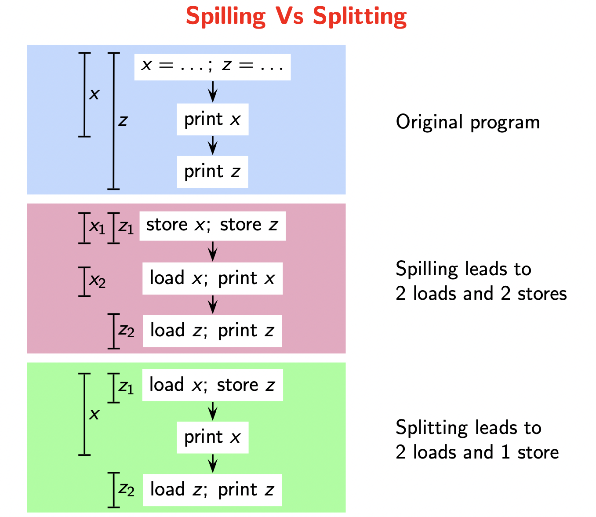

# Lecture 22

> `06-04-22`

Following the analysis of live ranges, we construct the interference graph. Along with the degree of each node, we note the number of loads and stores of each variable. We define **spill cost** as the sum of loads and stores for each variable.

### Chaitin-Briggs Allocator

Let $$k$$ be the number of colors. We discuss Chaitin’s method first.

1. We simplify the graph by removing the nodes in an arbitrary order such that for each node $$n$$, $$D(n) < k$$ and push them no a stack. Since $$D(n) < k$$, we are guaranteed to find a color for $$n$$.

   > How to prove?

2. If the graph is not empty, we find the node with the lease spill cost, and then we spill it. That is, we further simplify the graph by removing nodes with the lowest spill cost. Then, we repeat the first step.

3. Now, after all the simplification is done, we repeatedly pop the node from the top of the stack, plug it in the graph and give it a color distinct from its neighbour.

Now, let us see Briggs’ method

1. Same as that of Chaitin’s method.
2. Briggs’ conjectured that it is not necessary for all nodes with a degree greater than $$n$$ not to have a color in the coloring. So, we mark the nodes as potentially spill-able and stack them.
3. As in Chaitin’s method, we repeatedly color the nodes. If a node cannot be colored, we spill it and go back to the first step.

### Spilling Decisions

- Spill cost is weighted by loop nesting depth 

  
  $$
  C(n) = (L(n) + D(n)) \times 10^d
  $$
  
- Sometimes, we normalise $$C(n)$$ and consider $$C(n)/D(n)$$.

Chaitin’s method cannot color the square/diamond graph with 2 colors whereas Briggs’ method can.

**Note.** We consider the degree of nodes in the original graph. That is, when we simplify the graph in step 1, we don’t update the degrees of all the nodes at each iteration.

### Allocating registers

Once we allocate the colors, we replace each variable by a register corresponding to a color. After replacing the code with registers, there would be redundant statements like `r4 = r4`. We can get rid of such statements, and this is known as **Peephole Optimisation**. (This happens due to control transfer)

### Live range spilling

Spilling a live range $$l$$ involves keep the variable of $$l$$ in the memory. For RISC architecture, load in a register for every read, store back in the memory for every write. For CISC architectures, we access directly from the memory.

Spilling is necessary if the number of interfering live ranges at a program point exceeds the number of registers. *Flow sensitivity* (interval interferes with, say, 1 interval at any given time) vs *Flow insensitivity* (total number of overlaps is greater than 1).

Splitting a live range $$l$$ involves creating smaller live ranges $$l_1, \dots, l_k$$ such that $$D(l_i) \leq D(l), 1 \leq i \leq k$$.  Live ranges $$l_i$$ can participate in graph coloring if $$D(l_i) < D(l)$$. Therefore, we have a choice between splitting and spilling. The difference between the two approaches is shown here.

## Registers across Calls

So far, we have seen allocation of local registers. Suppose we have the following situation. A function `g()` uses a register `r` and calls `f()` inside its body. Now, how do we manage `r` across the call?

- Procedure `g` saves it before the call and restores it after the call. However, `g()` does not know if `f()` requires `r`. Here, save and restore is redundant if `f` does not require `r`, and this is unavoidable. Also, it knows if the value in `r` is need after the call. Here, save and restore is redundant if `r` is not required across the call, and this is avoidable.
- Procedure `f` saves it at the start and restores it at the end. Now, `f` does not know if `g` uses `r` after the call, but it knows if `r` is required in `f`. Like before, the first problem is unavoidable but the second one is avoidable.

Now, as both methods are functionally similar, the method used is a matter of convention. The **architecture** decides this for the system. So, we have

- **Caller-saved register** - Callee can use it without the fear of overwriting useful data
- **Callee-saved register** - Caller can use it without the fear of overwriting useful data.

We use a caller-saved register `r` for values that are not live across a call. Then, `r` is not saved by the callee and need not be saved by the caller. We use a callee-saved register `r` for values that are live across a call. `r` is not saved by the caller, and it is saved by the callee only if it is needed. 

### Integrating with graph coloring

To begin with, the live range of a callee saved register is the entire procedure body of `g`, and the live range of a caller saved register is the procedure body of `f`. We then construct the interference graphs with these additional live ranges.