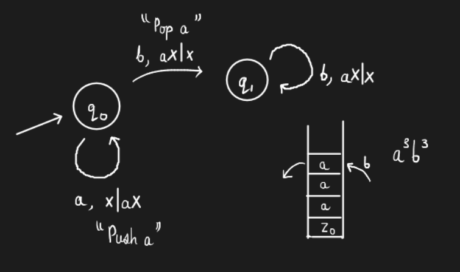
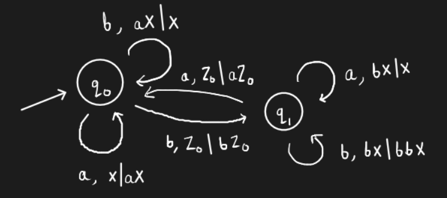

# Lecture 3

## Chomsky Hierarchy

## Regular Expressions

We define these languages using a base case and an inductive rule. **Empty string** is not the same as the **empty set**. The base case to be considered is $$L = \{\epsilon\}$$?

### Inductive Rules

**Lemma.** If $$E_1, E_2$$ are regular expressions, then so are

- $$E_1 + E_2$$ - Union
- $$E_1.E_2$$ - Concatenation
- $$E_1^*$$ - Kleene star
- $$(E_1)$$ - Parentheses

"Nothing else" is a regular expression. That is, we must use the four rules mentioned above to construct a regular expression.

The fourth rule can be used as follows - $$L((ab)^*) = \{\epsilon, ab, abab, ababab, ...\}$$. The parentheses help us group letters from the alphabet to define the language.

***Example.*** Construct a language with <u>only even number of a's'</u>. Good strings include $$\{aba, baabaa\}$$, and bad strings include $$\{abb, bbabaa\}$$. 

The automata can be easily drawn as -

How do we write a regular expression for this? Consider the expression $$R = (ab^*ab^*)^*$$. However this expression does not include strings that start with $$b$$.

> ***Homework.*** Try and fix this expression -
>
> $$R = b^*.(ab^*ab^*)^*$$

***Example.*** Construct an expression for defining the language $$L = \{\text{all strings with even number of a's} \text{and odd number of b's}\}$$

The following automaton would work for this language -

>***Homework***. Find a regular expression for the above language.

***Example.*** What language does the regular expression $$b^*ab^*(ab^*ab^*)^*$$?

It represents the language with an <u>odd</u> number of $$a$$'s. How do we check this? Start with the base cases - It has $$\epsilon$$, and it also has $$\{ab, ba\}$$. Try to check the pattern and use induction. 

We will soon learn how to derive relations such as "Is $$L = \phi$$?", "Is $$\|L\| = \infty$$?", "Is $$L_1 \subset L_2$$?"... All we are doing right now is exploring all the topics in the course using a BFS approach.

## Representation of Push-Down Automata

The bottom of the stack contains a special character that indicates the bottom of the stack. We design a Finite State Machine which knows the special characters (for bottom of the stack or other purposes) and also the top element in the stack. This FSM can pop or push on the stack to go to the next state.

***Example.*** Represent $$L = \{a^nb^n\}$$ using a FSM.

This is how a FSM is represented. A string is accepted **iff** the stack is empty. Note the transition from $$q_0$$ to $$q_1$$. It says that the top of the stack must be $$a$$. In case it isn't the case, the string is rejected. 

In a FSM, the string is rejected due to one of the two reasons - 

- No transition for the given input symbol or we reach the top stack symbol (in the case of finite length languages) 
- Input is over, and the stack is not empty.

***Example.*** Try the same for $$L = \{\text{equal \#}a's \text{ and } b's\}$$.

Does this work?

## Non-determinism

***Example.*** Represent $$L = \{ww^R\} \| w \in (a + b)^*\}$$. Here, "R" represents reverse. That is, this language is the language of palindromes. Here, we keep pushing and then we keep popping after a decision point. <u>The decision point is a non-deterministic guess</u>. If there is a correct guess, then the algorithm will work.

***Example.*** Is $$n$$ composite? How do we design a non-deterministic algorithm for this problem? 

1. Guess for a factor $$p < n$$
2. Check if $$p$$ divides $$n$$. If the answer is "yes" then it is composite, else repeat.

> How do we reject empty strings in PDA?
>
> Does adding accepting states in the FSM increase the representation power? Does using the special symbol in between the stack increase the representation power?

The reference textbook for this course is "Hopcroft Ullman Motwani."