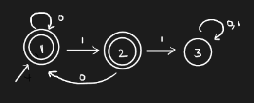

# Lecture 4

This was self-reading about automatons (DFA and NFA).

# Lecture 5 

> `11-01-22`

> ***Homework.*** Find the number of binary strings of length 10 with no two consecutive 1's.
>
> *Answer.* $$f$$ considers bit strings starting with $$0$$ and $$g$$ considers bit strings starting with $$1$$.
>
>
> $$
> \begin{align}
> f(1) &= 1; f(2) = 2; \\
> g(1) &= 1; g(2) = 1 \\
> f(n) &= f(n - 1) + g(n - 1); \\
> g(n) &= f(n - 1);
> \end{align}
> $$
>
> 
> $$
> f: \{1, 2, 3, 5, 8, \dots\} \\
> g: \{1, 1, 2, 3, 5, \dots \}
> $$
> Therefore, there are $$144$$ such required strings.

***Example.*** How do we construct an automata which captures the language of binary strings with no two consecutive 1's? We use something known as a **trap state**. All the bad strings will be *trapped* in that state, and no transition from the trap state will lead to a final state. Consider the following automaton.

Here, the 3rd state is the trap state.

### Extended transition function

$$\hat \delta : Q \times\Sigma^* \to 2^Q$$ is defined as

$$
\hat \delta(S, aW) = 
\begin{cases}
		\delta(S, a) & w = \epsilon \\
		\hat \delta(\delta(S, a), W) & \text{otherwise}
\end{cases}
$$

For the sake of convenience we drop the hat and use $$\delta$$ for the extended function (polymorphism).

> ***Homework.*** Read the proof for showing the equivalence of language sets in DFA.

## Non-determinism

Non-determinism basically refers to the procedures where we get the same output from the same input through *multiple runs*. In **don’t care** non-determinism, we get the same output with different algorithms/procedures. However, in **don’t know** non-determinism, a single stochastic algorithm goes through many runs (scenarios) to get the answer.

