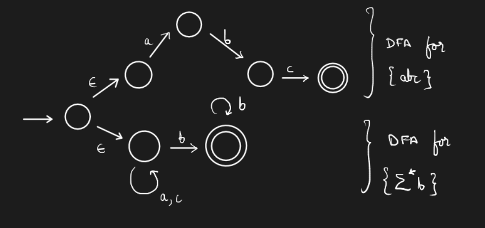

# Lecture 06 `13-01-22`

## Non-determinism

A deterministic automaton has a single choice of transition from a given state for a given symbol from the alphabet. However, in the case of a non-deterministic automata, such guarantee does not exist. The next state for a given symbol from a given state of the NFA is a set of states rather than a single state. There are two types of NFA (missed the definition for these)

- Don't know NFA
- Don't care NFA

One might ponder if NFAs are more expressive than DFAs. The answer is surprisingly no.

**Example.** Construct an automaton to represent the language $$L = \{abc\} \cup \{\text{all strings ending in b}\}$$ whose alphabet is $$\{a,b,c\}$$

**Note.** We have introduced $$\epsilon$$-transitions in this automaton.

As we shall see later in the course, the three models - DFA, NFA, and NFA with $$\epsilon$$-transitions; are all equivalent in terms of expressive power.

## Properties of Languages

- Decision - Is $$w \in L$$? (Membership Problem) - decidable for regular languages.

  Decidable problems - Problems for which we can write a *sound* algorithm which *halts in finite time*.

  We can also consider problems like - Given $$DFA(M_1)$$ and $$DFA(M_2)$$, Is $$L(M_1) = L(M_2)$$? or $$L(M_1) \subset L(M_2)$$?

  Is $$L = \phi$$? Is $$L$$ finite? Is $$L$$ finite and has an even number of strings? We can also ask questions about the DFA - Can $$L(M)$$ be accepted by a DFA with $$k < n$$ states (minimalism)?

  ***Example.*** Can we build a DFA whose language is $$L = \{\text{bit strings divisible by } 7\}$$ with less than 7 states? Turns out the answer is no.

  Finally, we can ask a very difficult question such as - Show $$L$$ cannot be accepted by any DFA. The technique for solving such a question is known as the ***Pumping Lemma***.

- Closure - closure using Union, Intersection, Kleene Star, and Concatenation.

