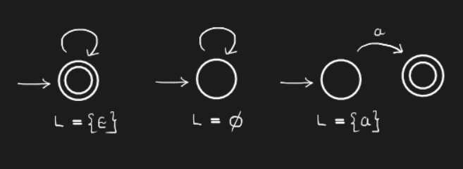

# Lecture 7

> `17-01-22`

We plan to show the equivalence of the following models -

- DFAs
- NFAs
- NFA-$$\epsilon$$
- Regular Expressions

> ***Homework.*** Draw a DFA for the language $$L_1 \cup L_2$$ where $$L_1$$ is $$a$$ followed by even number of $$b$$s and $$L_2$$ is $$a$$ followed by odd number of $$c$$s.

## Regular Expressions

They are defined using base cases and inductive cases. Before we discuss this, we define **closed-world** assumption. It is the presumption that a statement that is true is also known to be true. Therefore, conversely, what is not currently known to be true, is false. More info regarding this topic can be found [here](https://en.wikipedia.org/wiki/Closed-world_assumption). The base cases for regular expressions are given as follows.

$$
\begin{align}
L(a) &= \{a\} \\
L(\epsilon) &= \{\epsilon\}  \\
L(\phi) &= \phi \text{ (An empty set)}
\end{align}
$$

The inductive cases are

$$
\begin{align}
	L_1, L_2 &\to L_1 \cup L_2 \\
	L_1, L_2 &\to \{uv \vert u \in L_1, v \in L_2\} \\
	L &\to L_1^*
\end{align}
$$

## RE $$\equiv$$ NFA-$\epsilon$

To begin with, we convert the base cases of regular expressions to NFA-$$\epsilon$$s. Here are the automatons

Now, for the inductive cases -

- For union of $$L_1$$ and $$L_2$$, consider the NFAs of both languages. Create a new start state $$s$$ and final state $$f$$. Connect $$s$$ to the start states of both NFAs with $$\epsilon$$ transitions and the final states of both NFAs to $$f$$ with the same transitions. 

  > How do we prove that this construction represents the union?

- For concatenation of $$L_1$$ and $$L_2$$, connect all the final states of $$L_1$$’s NFA to all the start states of $$L_2$$’s NFA using $$\epsilon$$ transitions.

- For $$L^*$$, connect all the final states of the NFA to the start states of the NFA using $$\epsilon$$ transitions. However, this does not accept $$\epsilon$$. Fix it. Think.

