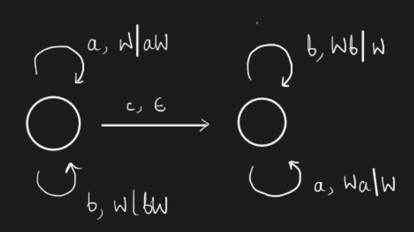

# Lecture 12

> `27-01-22`

We had seen the CFG for the language $$L = \{a^nb^n\}$$. How can one prove that the rules represent that language? That is, how do we know that the rules generate <u>all the strings</u> in the language and <u>no other strings</u>? 

Consider the language we saw in the previous lecture - strings with equal number of a’s and b’s. The possible set of rules are -

$$
\begin{align}
S &\to aB \ \vert \ bA \\
B &\to b \ \vert \ bS \ \vert \ aBB \\
A &\to a \ \vert \ aS \ \vert \ bAA \\
\end{align}
$$

The thinking is as follows - 

- $$S$$ generates strings with equal number of a’s and b’s. $$B$$ generates strings with one more b than a’s, and similarly for $$A$$.
- To write the inductive cases of $$S$$, we consider strings starting with both a and b. Inductive cases for $$A, B$$ are also constructed similarly.

Another possible set of rules are - 

$$
\begin{align}
S &\to aSb \ \vert \ bSa \\
S &\to \epsilon \\
S &\to SS \\
\end{align}
$$

These rules are the minimized set of the rules I wrote for the hw in the last lecture.

## Grammars

We can write grammars in canonical forms. A grammar is said to be in **Chomsky normal form** if the rules are of the form

$$
\begin{align}
C \to DE  &\text{ - one non-terminal replaced by 2 non-terminals} \\
C \to a &\text{ - one terminal replaced by a terminal}
\end{align}
$$

***Claim.*** Any grammar $$G$$ ($$\epsilon \not\in L(G)$$) can be converted to an equivalent Chomsky Normal form.

Another canonical form of grammar is **Greibach normal form**. The rules are of the form

$$
\begin{align}
C &\to a\alpha 
\end{align}
$$

Each non-terminal converts to a terminal followed by a symbol in $$(V \cup \Sigma)^*$$. Similar to the Chomsky form, every grammar can be converted to the Greibach normal form.

## Push Down Automatons

Consider the language $$L = \{wcw^R \vert w \in (a + b)^*\}$$.

>  ***Aside.*** Try writing the Chomsky normal form rules for the above language.
>  $$
>  \begin{align}
>  S &\to AA_0 \mid BB_0 \mid c \\
>  A_0 &\to SA \\
>  B_0 &\to SB \\
>  A &\to a \\
>  B &\to b \\ 
>  \end{align}
>  $$
>  

The pushdown automaton for this language is given by -

