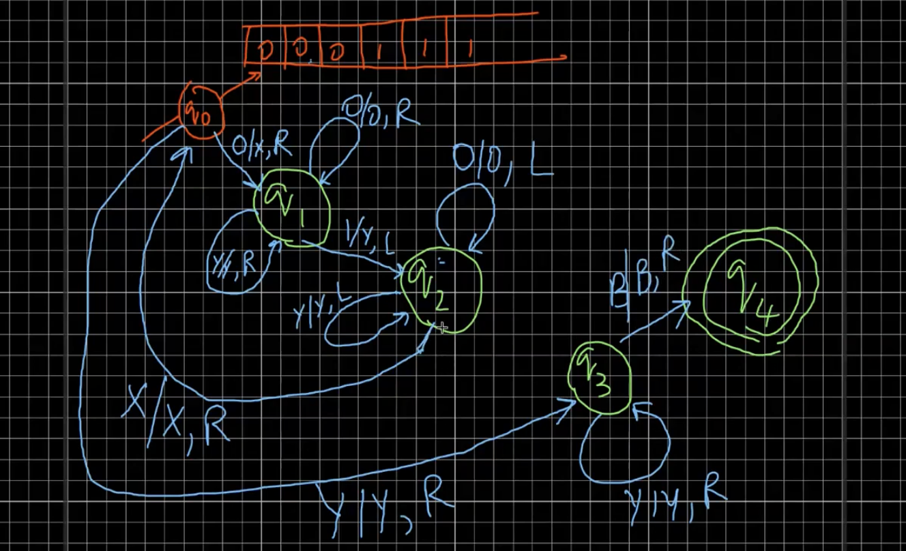

# Lecture 22

> `07-03-22`

## Dovetailing

In the Satan-Cantor game, the idea was to enumerate all possible answers “fairly”. 

Let us consider the scenario where Satan chooses a $$k$$ tuple of integers where $$k$$ is unknown. How do we enumerate this set? We use dovetailing for the same. Consider the tuple $$(k, n)$$. For one such given tuple, we will enumerate all $$k$$-tuples with distance from origin being less than $$n$$. The idea is that we are balancing the enumeration across two dimensions, $$k$$ and $$n$$, together. 

## Cantor’s diagonalization

How is the above set different from the power set of natural numbers? Let us consider the question in terms of languages. Consider a language $$L \subseteq \Sigma^*$$ with a finite $$\Sigma$$. $$\Sigma^*$$ is enumerable ($$\epsilon, a, b, c, aa, ab, ac, \dots$$). Now, is the set of all languages $$\mathcal L$$ enumerable? We know that $$\mathcal L = 2^{\Sigma^*}$$. 

We shall use contradiction to show that the set is not enumerable. Consider the following table - 

|            | $$\epsilon$$ | $$a$$ | $$\dots$$  |
| ---------- | ------------ | ----- | ---------- |
| $$L_1$$    | 1            | 0     |            |
| $$L_2$$    | 1            | 1     |            |
| $$\vdots$$ |              |       | $$\ddots$$ |

The table consists of all the languages (assuming they are enumerable) with the respective strings in the language tagged as 1. Define the language $$L_{new} = \{w_i \mid w_i \not \in L_i\} \forall i \in \mathcal N$$. We then have a contradiction that $$\exists L_{new}$$ such that $$l_{new} \neq L_i$$ for any $$i$$. 

**Claim.** The state of every computer can be encoded as a *single* number.

## Turing Machines (2)

The machine can do the following things

- Replace the symbols on the tape by symbols in $$T$$ where $$\Sigma \subseteq T - \{B\}$$. $$B$$ is a blank symbol to denote an empty cell
- Move left or right by one step
- Go to the next state

So, the labels on the transitions of the FSM are of the form $$X \mid Y, D$$ where $$X, Y \in T$$ and $$D = L \mid R$$. It means that the symbol $$X$$ in the cell is replaced by the symbol $$Y$$. The machine has to *definitely* move left or right in each transition. A “run” starts from the first cell and the state $$q_0$$ in the FSM. As an example, we consider the following FSM for the language $$L = \{0^n1^n \mid n \geq 1\}$$. 

In a Turing machine, we halt when there is no move possible.  

Formally, a Turing machine is defined as $$T = (Q, \Sigma, T, \delta, q_0, B, F)$$ where $$\delta: Q \times T \to Q \times T \times \{L, R\}$$. There are many variations possible to this machine which we shall show are equivalent to this simple definition. For example, we can have multiple tapes, output tape, non-determinism, etc.

 