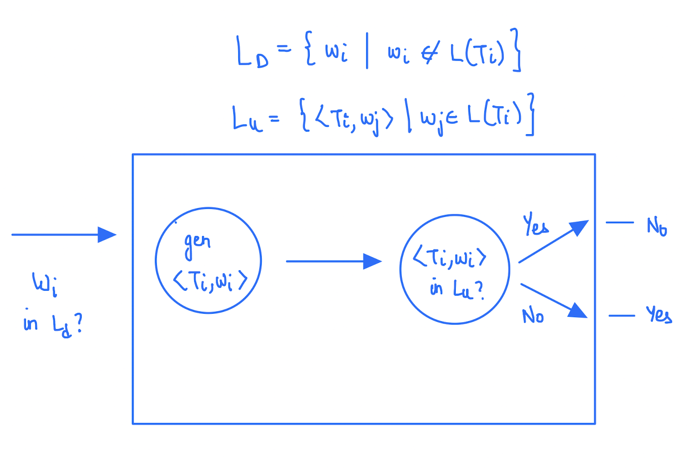

# Lecture 35

> `05-04-22`

Let us continue the discussion on the Universal Turing Machine. The encoding of a move $$\delta(q_i, X_j) = (q_k, Xl, D_m)$$ in a Turing Machine is $$0^i10^j10^k10^l10^m$$. The universal TM works in 3 steps

- Decode/Validate
- Set up the tapes
- Simulate

Also, we had shown that $$L_u$$ is recursively enumerable by the construction of the universal TM. Suppose, there is a TM that halts every time for $$L_u$$. Now, we will show that $$L_u$$ is recursive then $$L_d$$ is recursive. To do that, we will convert $$L_d$$ into an instance of $$L_u$$.



Here, we can see that we are able to answer the question $$w_i \in L_d$$ by constructing a TM using the Universal TM. That is, if the Universal TM is recursive, then $$L_d$$ is also recursive. *Think*.

## Reduction Technique

 To understand this technique, consider the following two problems

- $$L_{ne} = \{\lang M \rang \mid L(M) \neq \phi\}$$ - Machine accepts at least one string
- $$L_{rec} = \{\lang M \rang \mid L(M) \text { is recursive}\}$$ - Machine halts on all inputs

We can show that both are recursively enumerable. The first language can be shown as recursively enumerable using dovetailing (words and moves being the dimensions). To show non-recursivity, we convert $$L_d$$ or $$L_u$$ to an instance of this language. We need to try and come up with an algorithm that halts for machines with empty languages. 

> How do we do this?

The second problem is a little bit more difficult. 

In conclusion, given a language

- To prove that it is recursive, we need to construct a TM that halts on all inputs.
- To prove that it is recursively enumerable, we just need to construct a TM that halts on good inputs. To show that it is not recursive, we need to use reductions probably.
- To prove non recursively enumerable, we need to show that we can’t construct any TM.

TM is a powerful model as it is universal (self-referential), and it has many undecidable problems. They can represent Type-0 Grammar, Partial Recursive functions, and RAM (random access mechanism). 

## Post Correspondence Problem

Post is a mathematician. Consider the following table

| w    | x    |
| ---- | ---- |
| 1    | 111  |
| 1011 | 10   |
| 10   | 0    |

Now, take the string $$101111110$$. Can we decompose this string in terms of $$w_i$$ or $$x_i$$? For example, we can decompose the string as $$2113$$ in terms of $$w‘s$$ and $$2113$$ again in terms of $$x’s$$. These decompositions need not be unique.

So, PCP is stated as follows.

Given $$w = \{w_i \mid w_i \in \Sigma^* \}, x = \{x_i \mid x_i \in \Sigma^*\}$$ and a string $$ s \in \Sigma^*$$, we need to be able to come up with decompositions $$s = w_{i1} \dots w_{il}$$ and $$s = x_{j1}\dots x_{jl}$$ such that $$ik = jk$$ for $$k \in \{1, \dots, l\}$$.

Consider the following table.

| w    | x    |
| ---- | ---- |
| 10   | 101  |
| 011  | 11   |
| 101  | 011  |

Now, for any string $$s$$, we will not be able to come up with decompositions that are equal for the above sets.

The reason we came up with this problem, is to show that PCP is undecidable (not recursive). That is, no TM can halt correctly on all PCP instances. However, it is recursively enumerable as we can enumerate all sequences fairly. This can be shown by a reduction of $$L_u$$ to PCP. 

Let us now consider another problem - Ambiguity of CFGs. Can we build a TM that halts with a ‘yes’ if the input CFG has an ambiguity and with a ‘no’ is it does not. In an ambiguous grammar, a single word has multiple derivations in the grammar. That is, we have multiple structurally different derivation trees. Using this problem we are trying to show the importance of **direction of reduction**. We know that PCP is undecidable. Therefore, we need to reduce PCP to an instance of the CFG problem. That is, we’ll essentially show that is the CFG problem is decidable, then so is PCP. 

PCP is essentially a pair of sets of strings. What is the grammar corresponding to these sets such that when PCP has a solution, the grammar is ambiguous and unambiguous otherwise? We introduce $$k$$ new symbols $$a_1, \dots, a_k$$. We construct the following grammar

```
S -> Sa | Sb
Sa -> w_i Sa a_i | w_i a_i
Sb -> x_i Sb a_i | x_i a_i
```

 It is easy to see that this grammar meets our requirements. To prove this, we need to show the proof in two directions

- If PCP has a solution, then G is ambiguous
- If G is ambiguous, then PCP has a solution. Here, we need to show that ambiguity happens only due to `Sa` and `Sb`.

> Why did we introduce `a`?

**Note.** To show problem A is undecidable knowing that problem B is undecidable, we essentially show that A is a subroutine of B.

## Properties of Recursive Languages

If $$L_1$$ and $$L_2$$ are both recursive, then so are

- $$L_1 \cup L_2$$
- $$L_1 \cap L_2$$
- $$L_1 - L_2$$
- $$L_1^c$$
- $$L_1L_2$$

The intersection and complement closure break in case of recursively enumerable languages **(?)**