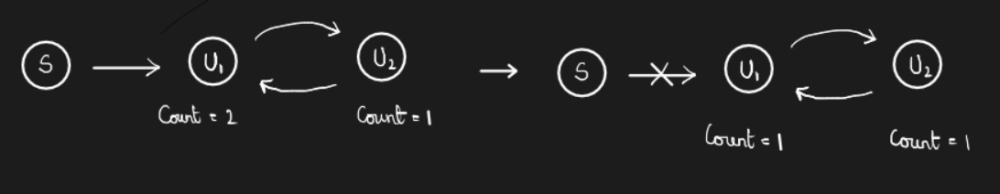

# Lecture 7

Continuing the previous referential-integrity constraints. Suppose we have the command

```sql
create table person(
	ID char(10),
	name char(10),
	mother char(10),
	father char(10),
	primary key ID,
	foreign key father references person,
	foreign key mother references person
)
```

How do we insert tuples here without violating the foreign key constraints? We can initially insert the name attributes and then the father and mother attributes. This can be done by inserting `null` in the mother/father attributes. Is there any other way of doing this? We can insert tuples by using the acyclicity among the tuples using topological sorting. There is also a third way which is supported by SQL. In this method, we can ask the database to defer the foreign key checking till the end of the transaction. 

### Complex check conditions

The predicate in the check clause can be an arbitrary predicate that can include a subquery **(?)** For example, 

```sql
check (time_slot_id in (select time_slot_id from time_slot))
```

This condition is similar to a foreign key constraint. We have to check this condition not only when the ‘section’ relation is updated but also when the ‘time_slot’ relation is updated. Therefore, <u>it is not currently supported by any database!</u>

### Built-in Data Types in SQL

In addition to the previously mentioned datatypes, SQL supports `date`s, `interval`s, `timestamp`s, and `time`. Whenever we subtract `date` from a `date` or `time` from `time`, we get an `interval`.

Can we store files in our database? Yes! We can store large objects as 

- `blob` - Binary large object - Large collection of uninterpreted binary data (whose interpretation is left to the application outside of the database system).
- `clob` character large object - Large collection of

Every database has its own limit for the maximum file size.

### Index Creation

An **index** on an attribute of a relation is a data structure that allows the database system to find those tuples in the relation that have a specified value for that attribute efficiently, without scanning through all the tuples of the relation. We create an index with the `create index` command 

```sql
create index <name> on <relation-name> (attribute):
```

Every database automatically creates an index on the primary key.

### Authorization

We can assign several forms of authorization to a database

- **Read** - allows reading, but no modification of data
- **Insert** - allows insertion of new data, but not modification of existing data
- **Update** - allows modification, but not deletion of data
- **Delete** - allows deletion of data

We have more forms on the schema level

- **Index** - allows creation and deletion of indices 
- **Resources**, **Alteration**
- **Drop** - allows deleting relations

Each of these types of authorizations is called a **privilege**. These privileges are assigned on specified parts of a database, such as a relation, view or the whole schema. 

The `grant` statement is used to confer authorization.

```sql
grant <privilege list> on <relation or view> to <user list>
-- Revoke statement to revoke authorization
revoke select on student from U1, U2, U3
```

- `<user list>` can be a user-id, **public** or a *role*. Granting a privilege on a view does no imply granting any privileges on the underlying relations. 
- `<privilege-list>` may be **all** to revoke all privileges the revokee may hold.
- If `<revoke-list>` includes **public**, all users lost the privilege except those granted it explicitly. 
- If the same privilege was granted twice to the same user by different grantees, the user may retain the privilege after the revocation. All privileges that depend on the privilege being revoked are also revoked.

One of the major selling points of Java was a *garbage collector* that got rid of `delete`/`free` and automatically freed up unreferenced memory. This action is done via a *counter* which keeps a count of the variables that are referencing a memory cell. SQL uses a similar counter for keeping track of permissions of various objects. However, this approach fails in case of cycles in the dependency graph. For instance, consider the following situation



This problem does not occur in case of programming languages. The solution to this problem is ***`TODO`***.

What about garbage collection when the program is huge? Is it efficient? Currently, many optimizations, like *incremental garbage collection*, have been implemented to prevent freezing of a program for garbage collection. Even after this, Java is not preferred for real-time applications. However, programmers prefer Java because of the ease of debugging and writing programs.

### Roles

A **role** is a way to distinguish among various users as far as what these users can access/update in the database. 

```sql
create a role <name>
grant <role> to <users>
```

There are a couple more features in authorization which can be looked up in the textbook.

We can also give authorization on views. 

### Other authorization features

- references privilege to create foreign key

  `grant reference (dept_name) on department to Mariano`

- transfer of privileges

  ```sql
  grant select on department to Amit with grant option;
  revoke select on department from Amit, Satoshi cascade;
  revoke select on deparment from Amit, Satoshi restrict;
  ```

  
