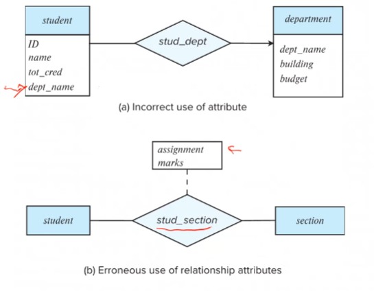

# Lecture 11 

> `25-01-22`

We express cardinality constraints by drawing either a directed line $$(\to)$$, signifying ‘one’, or an undirected line $$(-)$$, signifying ‘many’, between the relationship set and the entity set. 

Let us now see the notion of participation.

**Total participation** - every entity in the entity set participates in at least one relationship in the relationship set. This is indicated using a double line in the ER diagram.

**Partial participation** - some entities may not participate in any relationship in the relationship set.

We can represent more complex constraints using the following notation. A line may have an associated minimum and maximum cardinality, shown in the form ‘l..h’. A minimum value of 1 indicates total participation. A maximum value of 1 indicates that the entity participates in at most one relationship. A maximum value of * indicates no limit.

How do we represent cardinality constraints in Ternary relationships? We allow at most one arrow out of a ternary (or greater degree) relationship to indicate a cardinality constraint. For instance, consider a ternary relationship R between A, B and C with arrows to B, then it indicates that each entity in A is associated with at most one entity in B for an entity in C.

Now, if there is more than one arrow, the understanding is ambiguous. For example, consider the same setup from the previous example. If there are arrows to B and C, it could mean

- Each entity in A is associated with a unique entity from B and C, or
- Each pair of entities from (A, B) is associated with a unique C entity, and each pair (A, C) is associated with a unique entity in B.

Due to such ambiguities, more than one arrows are typically not used.

### Primary key for Entity Sets

By definition, individual entities are distinct. From the database perspective, the differences are expressed in terms of their attributes. A key for an entity is a set of attributes that suffice to distinguish entities from each other.

### Primary key for Relationship Sets

To distinguish among the various relationships of a relationship set we use the individual primary keys of the entities in the relationship set. That is, for a relationship set $$R$$ involving entity sets $$E_1, E_2, \dots, E_n$$, the primary key is given by the union of the primary keys of $$E_1, E_2, \dots, E_n$$. If $$R$$ is associated with any attributes, then the primary key includes those too. The choice of the primary key for a relationship set depends on the mapping cardinality of the relationship set.

**Note.** In one-to-many relationship sets, the primary key of the **many** side acts as the primary key of the relationship set.

### Weak Entity Sets

Weak entity set is an entity set whose existence depends on some other entity set. For instance, consider the section and course entity set. We cannot have a section without a course - an existence dependency. What if we use a relationship set to represent this? This is sort of redundant as both section and course have the course ID as an attribute. Instead of doing this, we can say that section is a weak entity set identified by course.

In ER diagrams, a weak entity set is depicted via a double rectangle. We underline the discriminator of a weak entity set with a dashed line, and the relationship set connecting the weak entity set (using a double line) to the identifying strong entity set is depicted by a double diamond. The primary key of the strong entity set along with the discriminators of the weak entity set act as a primary key for the weak entity set.

Every weak entity set must be associated with an **identifying entity set**. The relationships associating the weak entity set with the identifying entity set is called the **identifying relationship**. Note that the relational schema we eventually create from the weak entity set will have the primary key of the identifying entity set.

### Redundant Attributes

Sometimes we often include redundant attributes while associating two entity sets. For example, the attribute `course_id` was redundant in the entity set section. However, when converting back to tables, some attributes get reintroduced.

## Reduction to Relation Schemas

Entity sets and relationship sets can be expressed uniformly as *relation schemas* that represent the content of the database. For each entity set and relationship set there is a unique schema that is assigned the name of the corresponding entity set or relationship set. Each schema has a number of columns which have unique names.

- A strong entity set reduces to a schema with the same attributes.
- A weak entity set becomes a table that includes a column for the primary key of the identifying strong entity set.
- Composite attributes are flattened out by creating separate attribute for each component attribute.
- A multivalued attribute $$M$$ of an entity $$E$$ is represented by a separate schema $$EM$$. Schema $$EM$$ has attributes corresponding to the primary key of $$E$$ and an attribute corresponding to multivalued attribute $$M$$.
- A many-to-many relationship set is represented as a schema with attributes for the primary keys of the two participating entity sets, and any descriptive attributes of the relationships set.
- Many-to-one and one-to-many relationship sets that are total on the many-side can be represented by adding an extra attribute to the ‘many’ side. If it were not total, null values would creep up. It is better to model such relationships as many-to-many relationships so that the model needn’t be changed when the cardinality of the relationship is changed in the future.

### Extended ER Features

**Specialization** - Overlapping and Disjoint; Total and partial.

How do we represent this in the schema? Form a schema for  the higher-level entity and for the lower-level entity set. Include the primary key of the higher level entity set and local attributes in that of the local one. However, the drawback of such a construction is that we need to access two relations (higher and then lower) to get information.

**Generalization** - Combine a number of entity sets that share the same features into a higher-level entity set. 

**Completeness constraint** specifies whether or not an entity in the higher-level entity set must belong to at least on of the lower-level entity sets within a generalization (total and partial concept). Partial generalization is the default.

**Aggregation** can also be represented in the ER diagrams.

- To represent aggregation, create a schema containing - primary key of the aggregated relationship, primary key of the associated entity set, and any descriptive attributes.

> I don’t understand aggregation

### Design issues

