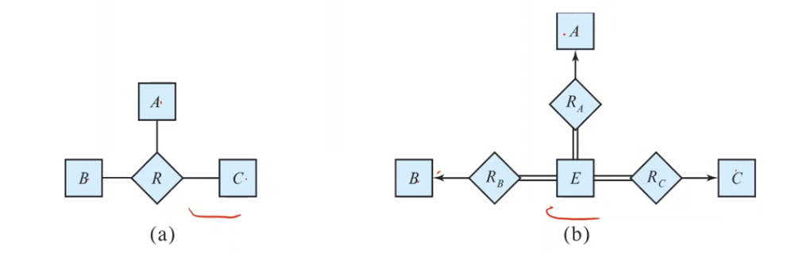

# Lecture 12

> `27-01-22`

### Binary vs. Non-Binary Relationships 

We had discussed this previously in [this](degree-of-a-relationship-set) section. In general, any non-binary relationship can be represented using binary relationships by creating an artificial entity set. We do this by replacing $$R$$ between entity sets $$A, B, C$$ by an entity set $$E$$, and three relationship sets $$R_i$$ relating $$E$$ and $$i \in \{A, B, C\}$$. We create an identifying attribute for E and add any attributes of $$R$$ to $$E$$.  For each relationship $$(a_i, b_i, c_i)$$ in $$R$$, we 

- create a new entity $$e_i$$ in the entity set $$E$$
- add $$(e_i, j_i)$$ to $$R_j$$ for $$j \in \{A, B, C\}$$

We also need to translate constraints (which may not be always possible). There may be instances in the translated schema that cannot correspond to any instance of $$R$$. We can avoid creating an identifying attribute for $$E$$ by making it a weak entity set identified by the three relationship sets.

### ER Design Decisions

**Important Points**

- A weak entity set can be identified by multiple entity sets.
- A weak entity set can be identified by another weak entity set (indirect identification).
- In SQL, the value in a foreign key attribute can be null (the attribute of the relation having the fks constraint).

### UML

The **Unified Modeling Language** has many components to graphically model different aspects of an entire software system. The ER diagram notation we studied was inspired from the UML notation.

# ~Chapter 7: Functional Dependencies

When programmers usually skip the design phase, they run into problems with their relational database. We shall briefly mention these problems and see the motivation for this chapter.

A good relational design does not have repetition of information, and no unnecessary null values. The only way to avoid the repetition of information is to decompose a relation to different schemas. However, all decompositions are not **lossless**.
