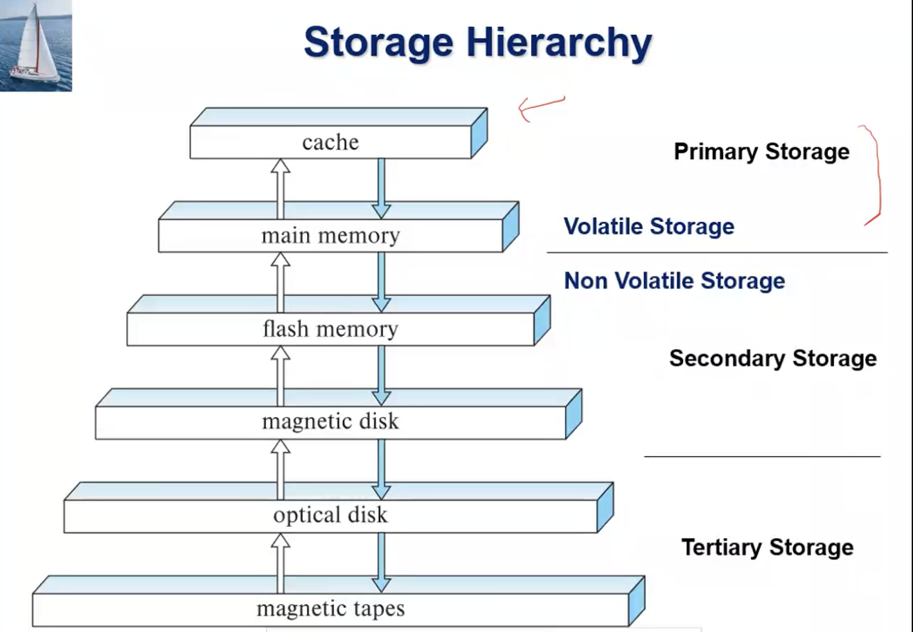

# Lecture 21

> `28-02-22`

### Parallel graph processing

Two popular approaches have been devised for parallel processing on very large graphs

- Map-reduce and algebraic frameworks
- **Bulk synchronous processing (BSP)**

### Bulk Synchronous Processing

Each vertex of a graph has data associated with it. The vertices are partitioned across multiple machines, and state of the nodes are kept in-memory. Now, in each step (*superstep*)

- Nodes process received messages
- Update their state
- Send further messages or vote to halt
- Computation ends when all nodes vote to halt, and there are no pending messages

The method is synchronous as the computation is done in steps. However, this method is not fault tolerant as all the computations need to be recomputed in case of a failure. Checkpoints can be created for restoration.

# ~Chapter 11: Data Analytics

- **Data Analytics** - The processing of data to infer patterns, correlations, or models for prediction. 
- Data often needs to be **extracted** from various source formats, **transformed** to a common schema, and **loaded** into the <u>data warehouse</u>. (ETL)
- **Data mining** extends techniques developed by ML onto large datasets
- A **data warehouse** is a repository of information gathered from multiple sources, stored under a unified schema at a single site. It also permits the study of historical trends. The common schema is <u>optimised for querying and not transactions</u>. The schema is most often **denormalized** (faster query time).
- Data in warehouses can be stored as **fact tables** or **dimension tables**. The attributes of fact tables can be usually viewed as **measure attributes** (aggregated upon) or **dimension attributes** (small ids that are foreign keys to dimension tables).
- A fact table branching out to multiple dimension schema is a **star schema**. A **snowflake schema** has multiple levels of dimension tables (can have multiple fact tables).
- A **data lake** refers to repositories which allow data to be stored in multiple formats without schema integration. Basically, data is just dumped for future use.
- Data warehouses often use **column-oriented storage**.

# ~Chapter 12: Physical Storage Systems

The performance of a database engine depends on the way data is stored underneath. The storage hierarchy typically used is as follows

Tertiary storage is used for data archives in today’s world. Data is read as a cache-line from the main memory (lookahead sorta). Similarly, to account for even higher latency of the flash memory, we read one page at a time. 

## Storage Interfaces

The way we interface with the storage also has a great impact on the performance. We have the following standards

- SATA (Serial ATA) - Supports upto 6 Gbps (v3)
- SAS (Serial Attached SCSI) - Supports upto 12 Gbps (v3)
- NVMe (Non-Volatile Memory Express) works with PCIe connecters and gives upto 24 Gbps.

