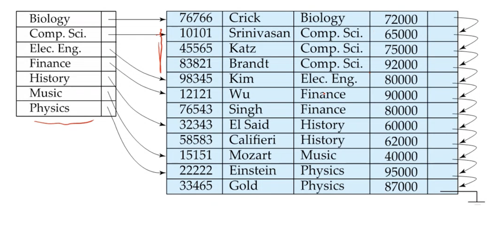

# Lecture 24

> `08-03-22`

### Partitioning

**Table partitioning** - Records in a relation can be partitioned into smalled relations that are stored separately - **Horizontal partitioning**. Store each attribute of a relation separately - **vertical partitioning**. Also known as **columnar representation** or **column oriented storage**. This is a good idea for data analytics but not for transaction processing. The benefits of this representation include

- Reduced IO if only some attributes are accessed
- Improved CPU cache performance
- Improved Compression
- Vector Processing on modern CPU architectures

The disadvantages are

- Tuple reconstruction is difficult
- Tuple deletion and updates are difficult
- Cost of decompression

Some databases support a hybrid model which has both row and column representation. 

**Note.** ORC and Parquet  use file formats with columnar storage inside file. These are log file formats.

## Storage Access

Blocks are units of both storage allocation and data transfer. At the disk layer, a page is the physical unit. **Buffer** - The portion of the main memory to store copies of the disk blocks. 

### Buffer Manager

**Pinned block** - A memory block that is not allowed to be written back to the disk. A **pin** is done before reading/writing data from a block. An **unpin** done when read/write is complete. Multiple concurrent pin/unpin operations are possible. There are also **shared and exclusive locks** on buffer. 

### Buffer Replacement Policies

Most OS replace the block using the LRU strategy. However, this is not suitable in many database operations. Therefore, a database system can query plan to predict future references. There are **toss-immediate** and **MRU** strategies too.

# ~Chapter 14: Indexing

A **search key** is a set of attributes used to look up records in a file. An **index file** consists of records (called **index entries**) of the form $$search-key \mid pointer$$.  These files are usually much smaller than the original file. We have two basic kinds of indices

- **Ordered indices** - SEarch keys are stored in a sorted order
- **Hash indices** - search keys are distributed uniformly across “buckets” using a “hash function”.

## Index Evaluation Metrics

- Access types supported by the indices. These include searching for records with a specified value or records falling in a specified range of values.
- Access time
- Insertion time
- Deletion time
- Space overhead

## Ordered Indices

A **clustering index** in a sequentially ordered file, is the index whose search key specifies the sequential order of the file. It is also called as the **primary index** that is not to be confused with primary key. A **secondary index/nonclustering** is an index whose search key specifies an order different from the sequential order of the file.

An index sequential file is a sequential file ordered on a search key, with a clustering index on the search key.

### Dense index Files

A **dense index** is an index for which there is a record in the index-file for every search-key value in the file.  Also, every index-record made with a dense index need not be mapped to an index as we use the following structure.

A **sparse index** on the other hand contains index records for only some search-key values. To locate a record with a search-key value $$K$$, we first find an index record with largest search-key value $$< K$$. Then, we search the file sequentially starting at the record to which the index record points. For unclustered index, we create a sparse index on top of a dense index (multilevel index).
