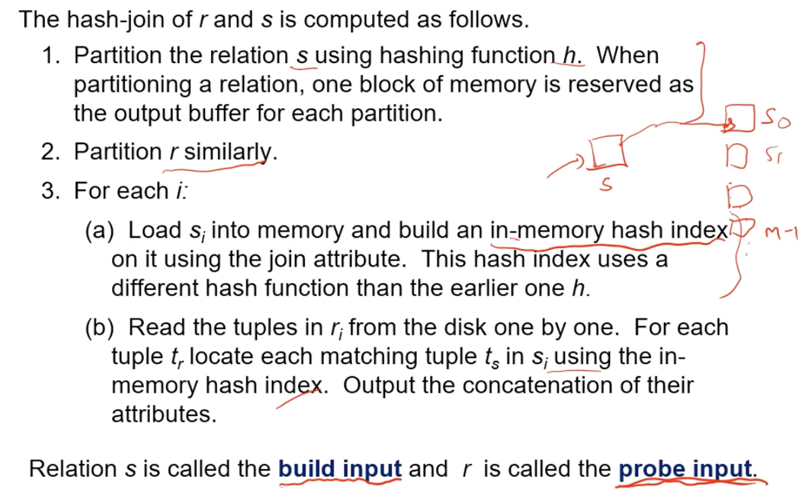

# Lecture 29

> `21-03-22`

## Join Operation

### Nested Loop Join

Requires no indices and can be used with any kind of join condition. It is very expensive though, as it is quadratic in nature. Most joins can be done in linear time in one of the relations, as most joins are foreign key joins. In the worst case, there would memory enough to hold only one block of each relation. The estimated cost then is, `n_r*b_s + b_r` block transfers and `n_r + b_r` seeks.

### Block Nested-Loop Join

We first do block matching and then tuple matching. Asymptotically, this looks same as the above method but it decreases the I/O cost as the number of seeks come down.

### Indexed Nested-Loop Join

An index is useful in equi-join or natural join. For each tuple $$t_r$$ in the outer relation $$r$$, we use the index to look up tuples in $$s$$ satisfy the join condition with tuple $$t_r$$. In the worst case, the buffer has space for only one page of $$r$$, and for each tuple in $$r$$, we perform an index lookup on $$s$$. Therefore, the cost of the join is `b_r(t_T + t_S) + n_r*C`, where $$c$$ is the cost of traversing index and fetching all matching $$s$$ tuples for one tuple of $$r$$. The second term is the dominating term. We should use the fewer tuples relations as the outer relation. 

### Merge Join

Sort both relations on their join attribute, and merge the sorted relations. Cost is `(b_r + b_s)*t_T + (ceil(b_r/b_b) + ceil(b_S/b_b))*t_S` along with the cost of sorting.

**Hybrid merge-join** - If one relation is sorted, an the other has a secondary $$B^+$$-tree on the join attribute, then we can merge the sorted relation with the leaf entries of the $$B^+$$-tree. Then we sort the result on the addresses of the unsorted relation’s tuples. Finally, we scan the unsorted relation in physical address order and merge with the previous result, to replace addresses by actual tuples.

### Hash Join

The goal in the previous methods was to simplify the relations so that they fit in the memory. Along with this, we can also parallelise our tasks. 

In this method, we hash on the join attributes and then merge each of the partitions. It is applicable for equi-joins and natural joins. 

The value $$n$$ and the hash function $$h$$ are chosen such that each $$s_i$$ fits in the memory. Typically, $$n$$ is chosen as $$\lceil b_s/M \rceil *f$$ where $$f$$ is a **fudge factor**. The probe relation need not fit in memory. We use **recursive partitioning** if number of partitions is greater than number of pages in the memory.

**Overflow resolution** can be done in the build phase. Partition $$s_i$$ is further partitioned using a different hash function. **Overflow avoidance** performs partitioning carefully to avoid overflows during the build phase. Both methods fail with a high number of duplicates.

Cost of hash join is `(3(b_r + b_s) + 4n_h)*t_T + 2t_T(ceil(b_r/b_b) + ceil(b_s/b_b))`. Recursive partitioning adds a factor of $$\log_{\lfloor M/bb\rfloor - 1}(b_s/M)$$.  If the entire build can be kept in the memory, then no partitioning is required and cost estimate goes down to $$b_r + b_s$$.

Can we not build an entire index on $$s$$ instead of hash join? Building an on-disk index is very expensive on disk. Indices have to be maintained which is an overhead. 

**Hybrid Hash-join** keeps the first partition of the build relation in memory. This method is most useful when $$M \gg \sqrt b_s$$. 

### Complex Joins

Similar methods to that of selection can be used here. That is conjunction of $$n$$ conditions requires intersections of the result of $$n$$ joins. In disjunction, we take the union of the join results. This method works for sets but not for multi-sets! For multi-sets, we can make sets out of the records.

### Joins on Spatial Data

There is no simple sort order for spatial joins. Indexed nested loops join with spatial indices such as R-trees, quad-trees and k-d-B-trees. Nearest neighbour joins can be done with tiling.

## Other operations

**Duplicate elimination** can be implemented via hashing or sorting. An optimisation is to delete duplicates during run generation as well as at intermediate merge steps. **Projection** can be done by performing projection on each tuple. **Aggregation** can implemented similar to duplicate elimination. Sorting and hashing can be used to bring tuples in the same group together, and then the aggregate functions can be applied on each group. 