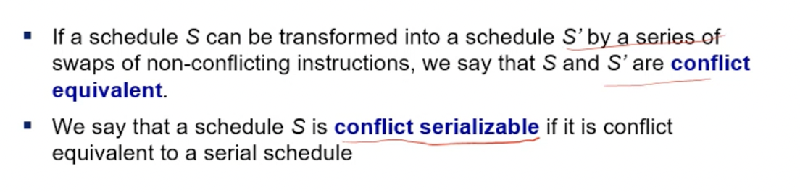

# Lecture 34

> `28-03-22`

We had discussed about view maintenance, but how do we use materialised views? A query optimiser can replace sub-expressions with appropriate views if the user writes the queries only in terms of relations. Sometimes, the opposite can also be useful.

Materialised view selection and index selection are done based on typical system **workload**. Commercial database systems provide <u>tuning</u> tools that automate this process.

### Top-K queries

The query optimiser should consider that only the top-k results are required from a huge relation.  This can be done via indexed nested loops join with the relation that is being used for sorting as the outer relation. There are other alternatives too.

### Multi-query Optimisation

Multiple queries with common sub-routines can be done in parallel.

### Parametric Query Optimisation

The evaluation plan can change based on the input parameters to the queries. To optimise this, we divide the range of the parameter into different partitions and choose a good evaluation plan for each partition.

# ~Chapter 17: Transactions

A **transaction** is a *unit* of program execution. It access and possible updates various data items. It also guarantees some well-defined robustness properties. To discuss transactions, we move to a level below queries where each *atomic* instruction is performed. We need to ensure correctness during failures and concurrency. 

In OS, we have seen that mutexes are used for concurrency. However, we need a higher level of concurrency in databases. 

**ACID guarantees** refer to Atomicity (Failures), Consistency (Correctness), Isolation (Concurrency) and Durability (Failures).  There is a notion of <u>consistent state</u> and <u>consistent transaction</u>. Durability refers to persistence in case of failures. Atomicity refers to all-or-nothing for each update. Partial updates are reversed using logs. Two concurrent transactions must execute as if they are unaware of the other in isolation. In conclusion, ACID transactions are a general systems abstraction. 

Concurrency increases processor and disk utilisation. It also reduces the average response time. Isolated refers to concurrently executing actions but showing as if they were occurring serially/sequentially. 

## Serialisability

A schedule is **serialisable** if it is equivalent to a serial schedule. We are assuming that transactions that are run in isolation are atomic, durable and preserve consistency.

**Conflict serialisable** schedules are a subset of serialisable schedules that detect or prevent conflict and avoid any ill effects. To understand these, we will consider `read`s and `write`s.

**Conflicting instructions** - Instructions form two transactions **conflict** only if one or both *update* the *same shared* item. For example, `write A` in T1 conflicts with `read A` in T2. These are similar to RAW, WAW, etc conflicts seen in Architecture course. 

We can swap the schedules of non-conflicting schedules and obtain a serial schedule. Such schedules are conflict serialisable. Conflict equivalence refers to the equivalence between the intermediate schedules obtained while swapping. More formally,

We are skipping **view equivalence**. There are other notions of serialisability (considering a group of operations).

### Testing for Conflict Serialisability

A **precedence graph** is a directed graph where vertices are transaction IDs and edges represent conflicting instructions with arrows showing the temporal order. Then, we can perform topological sorting to check for serialisability. A schedule is serialisability iff its precedence graph is acyclic.

