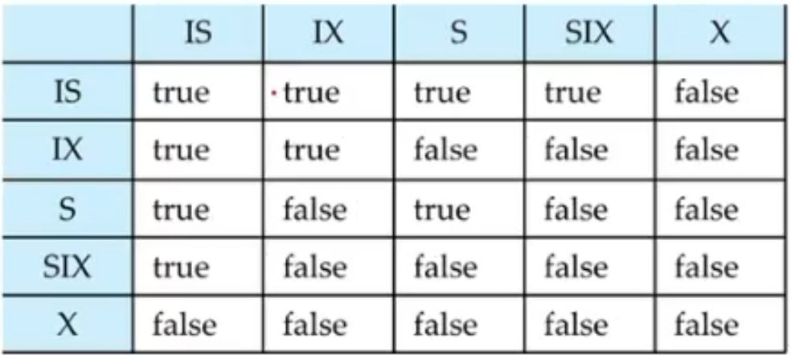
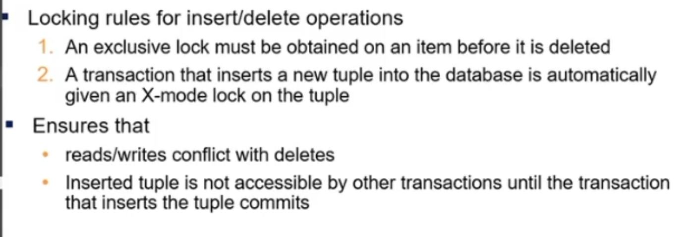

# Lecture 36

> `05-04-22`

## Implementation of Locking

A **lock manager** can be implemented as a separate process. The lock manager maintains an in-memory data-structure called a **lock table** to record granted locks and pending requests. A lock table is implemented as a hash table with queues. 

## Graph-Based Protocols

They impose a partial ordering $$\to$$ on the set $$D = \{d_1, \dots, d_n\}$$ of all the data items. If $$d_i \to d_j$$, then any transaction accessing both $$f_i$$ and $$f_j$$ must access $$d_i$$ before accessing $$d_j$$. 

A tree protocol ensures conflict serialisability as well as freedom from deadlock. However, it does not guarantee recoverability and it has other issues. 

## Deadlocks

There are other deadlock prevention strategies like

- **wait-die** - non-preemptive. Older transaction may wait for younger one to release the data item, and the younger transaction never wait for older ones. They are rolled back instead.
- **wound-wait** - preemptive. Older transaction *wounds* (forces rollback) of a younger transaction instead of waiting for it. 

In both the schemes, a rolled back transaction restarts with its original timestamp.

- Time-out based schemes

### Deadlock Recovery

There are two ways for rollback

- Total rollback
- Partial rollback - Roll back victim transaction only as far as necessary to release locks that another transaction in cycle is waiting for.

A solution for starvation is that the oldest transaction in the deadlock set is never chosen as victim of rollback.

## Multiple Granularity

A lock table might be flooded with entries when a transaction requires coarser granularity. The levels of granularity we use are database, area, file and record. What if we only use coarse granularities? The problem is that it’s not effective in terms of concurrency.

We use **intention locks** to take care of hierarchy of granularities.

### Intention Lock Modes

In addition to S and X, we have

- **Intention-shared** IS - Indicates explicit locking at a lower level of the tree but only with shared locks.
- **Intention-exclusive** IX - Indicates explicit locking at a lower level with exclusive or shared locks.
- **Shared and intention exclusive** SIX - The subtree rooted by that node is locked explicitly in shared mode and explicit locking is being done at a lower level with exclusive-mode locks. 

Intention locks allow a higher level node to be locked in S or X mode without having to check all descendent nodes. That is, to get a lock at the bottom level, we need to start taking intention locks from the root. Also, we have the following **compatibility matrix**.

The query engine decides all the locks based on the input queries. It follows adaptive lock granularity when it can’t decide. There is also a notion of **lock granularity escalation** in adaptive locking where the query engine shifts to a coarser granularity in case there are too many locks at a particular level.

Now, we discuss locking in the case of predicate reads. Consider an insert. You can lock the entire relation to ensure consistency, but when someone inserts a new record there won’t be any lock on it. So, we use the following rules.

Note that one also locks the metadata in two-phase locking scheme that helps it ensure serialisability.

## Phantom Phenomenon

A transaction $$T_1$$ performs a predicate read, and a transaction $$T_2$$ inserts a matching tuple while $$T_1$$ is active but after predicate read. As a result, some of these schedules are not serialisable.

### Handling Phantoms

If the conflict is at the data level, locking the metadata will prevent insertion and deletion in the relation. However, this provides very low concurrency for insertions and deletions.

### Index Locking to prevent Phantoms

Every relation must have at least one index. A transaction $$T_i$$ that performs a lookup must lock all the index leaf nodes that it accesses in $$S$$-mode. That is, it locks a range. A transaction $$T_j$$ that inserts, updates or deletes a tuple $$t_i$$ in a relation $$r$$ must update all indices to $$r$$. It can’t acquire X-lock in the locked range of $$T_i$$. So phantom reads won’t occur when the rules of two-phase locking protocol must be observed. The key idea here is that, tuples in the matching range will be sequential do to the index.

### Next-Key Locking to prevent Phantoms

This method provides higher concurrency. It locks all values that satisfy index lookup, and also lock the next key value in the index. 

Note that the above locks are done in the $$B^+$$ trees.