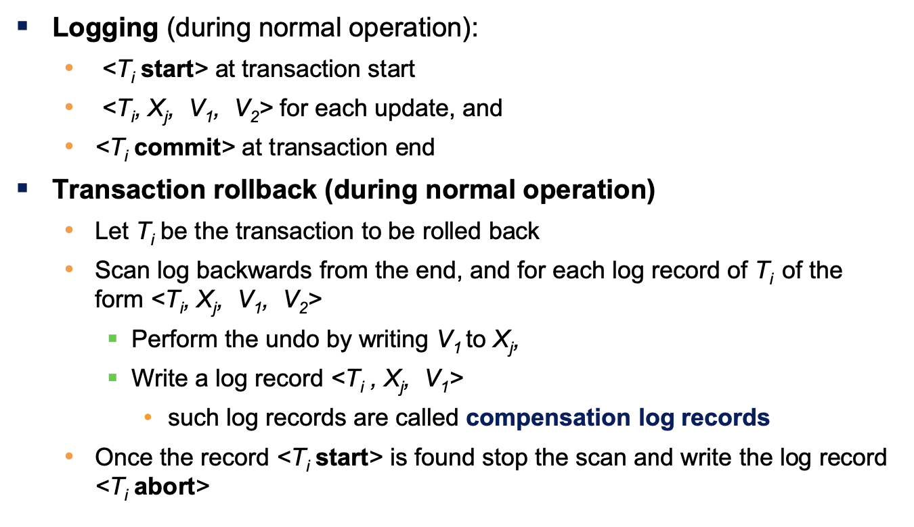
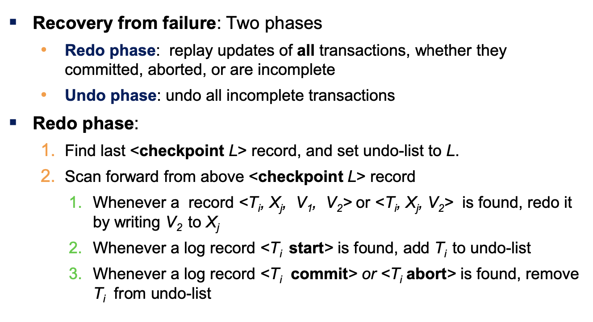
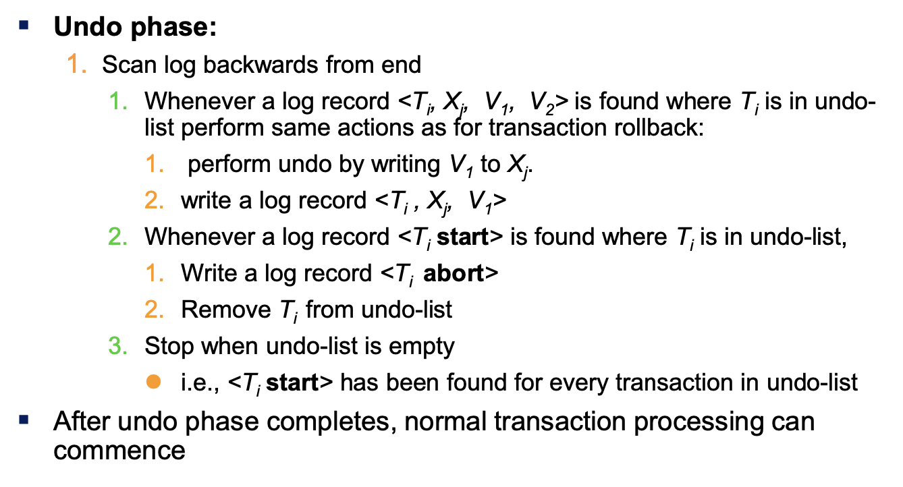

# Lecture 39

> `12-04-22`

 ## Recovery Algorithm

## Log Record Buffering

Log records are buffered in main memory, instead of being output directly to stable storage. When the buffer is full, a **log force** operation is performed.

As we had said, before a block of data in the main memory is output to the database, all log records pertaining to data in that block must have been output to stable storage. This rule is called as **write-ahead logging** or WAL rule. Strictly speaking, this is only required for undo transactions.

## Database Buffering

The recovery algorithm supports the **no-force policy** - updated blocks need not be written to disk when transaction commits. However, **force policy** is a more expensive commit. The recovery algorithm also supports the **steal policy** - blocks containing updates of uncommitted transactions can be written to disk, even before the transaction commits.

No updates should be in progress on a block when it is output to disk. It can be ensured by acquiring exclusive locks on the block before writing a data item. Locks can be released once the write is completed. Such locks held for short durations are called **latches**.

In summary, we acquire latch, do log flush, write block to disk and finally release the latch.

The **dual paging** problem refers to the extra I/O that is done when fetching a page from swap to buffer and then moving it to the disk. This can be prevented by letting the OS pass the control to the database when it needs to evict a page from the buffer. The database outputs the page to the database instead of the swap space, and release the page from the buffer.

## Fuzzy Checkpointing

to avoid long interruption of normal processing during checkpointing, we allow updates to happen during checkpointing. We permit transactions to proceed with their actions once we note the list $$M$$ of modified buffer blocks. We store a pointer to the **checkpoint** record in a fixed position **last_checkpoint** on disk once the all modified buffer blocks in $$M$$ are output to disk. During recovery, we use this last checkpoint.

## Failure with Loss of Nonvolatile Storage

Technique similar to checkpointing used to deal with the loss of non-volatile storage. That is, we periodically **dump** the entire content of the database to stable storage. No transaction may be active during the dump procedure. We perform the following - 

- output all log records from main memory to storage
- output all buffer blocks onto the disk
- copy the contents of the database to stable storage
- output a record $$(dump)$$ to lon on stable storage.

There are versions of **fuzzy dump** and **online dump**.

## Remote Backup Systems

We need to **detect failure** at the backup site using heartbeat messages and perform **transfer of control** to take control at the backup site. The log records are copied at the backup before, and recovery can be initiated. Once the primary site goes back up, we give back the control.

The **time to recover** is very important to reduce delay in takeover. Therefore, the backup sire periodically processed the redo log records, performs a checkpoint, and can then delete earlier parts of the log.

A **hot-spare** configuration permits very fast takeover - backup continually processes redo logs as they arrive and when the failure is detected, the backup rolls back incomplete transactions and is ready to process new transactions. An alternative to remote system backup is to use distributed systems.

We have the following levels of durability 

- **One safe** - Commit as soon as transaction’s commit log record is written at primary.
- **Two-very safe** - Commit when transaction’s commit log record is written at primary and backup.
- **Two-safe** - Proceed as in two-very-safe is both primary and backup are active. 

We also need to reduce latency for communication. We add a **near site** backup close to the primary site. Log records are replicated both at near site and remote backup site. If primary fails, remote backup site gets latest log records, which it may have missed, from near site.

---

#### END OF COURSE

---

