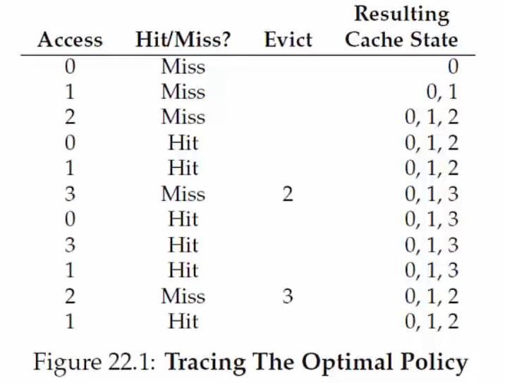

# Lecture 10 - Demand Paging

The main memory may not be enough to store all the page tables of active processes. In such cases, the OS uses a part of the disk (**swap space**) to store pages that are not in active use. Therefore, physical memory is allocated on demand, and this is called demand paging.

## Page Fault

The present bit in the page table entry indicates if a page of a process resides in the main memory or not (swap). When translating from VA to PA, the MMU reads the present bit. If the page is present in the memory, the location is directly accessed. Otherwise, the MMU raises a trap to the OS - **page fault**. (*No fault happened, actually*).

The page fault traps OS and moves CPU to kernel mode like any other system call. Then, the OS fetches the disk address of the page and issues a "read" to the disk. How does the OS know the location of pages on the disk? It keeps track of disk addresses (say, in a page table). The OS context switches to another process, and the current process is blocked.

> Suppose the CPU context switches from the MMU read from swap to another process. When it comes back to the process, the disk would have fetched the address from the swap. How does the MMU revert back to its previous state? The other process to which the CPU context switched will have used the MMU. -> See the below paragraph

Eventually, when the disk read completes, the OS updates the process's page table and marks the process as ready. When the process is scheduled again, the OS **restarts the instruction** that caused the page fault.

## Summary - Memory Access

The CPU issues a load to a VA for code/data. Before sending a request, the CPU checks its cache first. It goes to the main memory if the cache misses. **Note.** This is not the TLB cache. 

After the control reaches the main memory, the MMU looks up the TLB for VA. If TLB is hit, the PA is obtained, and the code/data is returned to the CPU. Otherwise, the MMU accesses memory, walks the page table (maybe multiple levels), and obtains the entry.

- If the present bit is set in PTE, the memory is accessed. Think about this point carefully. The frame may be present in physical memory or the swap.
- The MMU raises a page fault if the present bit is not set but is valid access. The OS handles page fault and restarts the CPU load instruction
- In the case of invalid page access, trap to OS for illegal access.		

## Complications in page faults

What does the OS do when servicing a page fault if there is no free page to swap in the faulting page? The OS must swap out an existing page (if modified, i.e., dirty) and then swap in the faulting page. However, this is too much work! To avoid this, the OS may proactively swap out pages to keep the list of free pages. Pages are swapped out based on the **page replacement policy**.	

## Page Replacement policies

The optimal strategy would be to replace a page that is not needed for the longest time in the future. This is not practical. We can use the following policies - 

**FIFO Policy** - Replace the page that was brought into the memory the earliest. However, this may be a popular page. 

**LRU/LFU** - This is commonly used in practical OS. In this policy, we replace the page that was least recently (or frequently) used in the past.

## Example - Page Replacement Policy

Suppose we can store only 3 frames in the physical memory, and there are 4 pages in the process. The set of accesses is also known as the **reference string**. Note that the initial few accesses are definitely missed, as the cache is empty - cold misses. The goal is to reduce the number of page faults, which leads to reading from the swap space and is slow.

**Belady's anomaly** - The performance of the FIFO may get worse when the memory size increases. 

The LRU works better as it makes use of the locality of references.

### How is LRU implemented?

The OS is not involved in every memory access.

> Why?

Therefore, the OS does not know which page is the LRU. There is some hardware help and some approximations which help the OS to find the LRU page. The MMU sets a bit in the PTE (*accessed* bit) when a page is accessed. The OS periodically looks at this bit to estimate pages that are active and inactive. 

> How often does the OS check this? Going through all pages also takes time. Are interrupts used?

The OS tries to find a page that does not have the access bit set to replace a page. It can also look for a page with the dirty bit not set to avoid swapping out to disk. 

> If the dirty bit is set, using that page would involve writing to disk. Why?