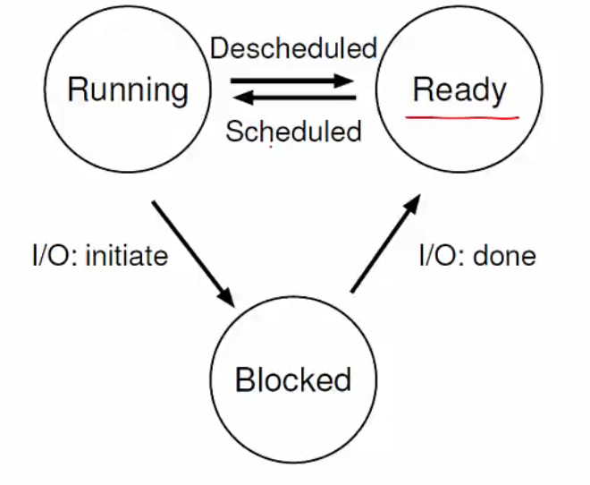
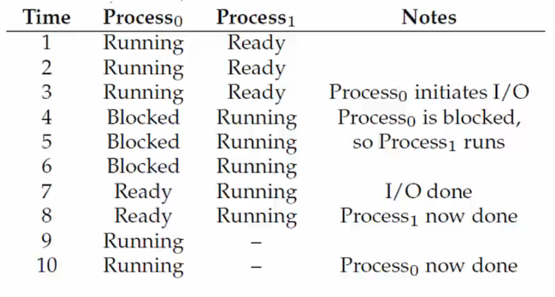

# Lecture 2 - The Process Abstraction

An operating system provides **process abstraction**. That is, when you execute a program, the OS creates a *process*. It timeshares CPU across multiple processes (virtualizing CPU). An OS also has a ***CPU scheduler*** that picks one of the many active processes to execute on a CPU. This scheduler has 2 components. 

1. **Policy** - It decides which process to run on the CPU
2. **Mechanism** - How to "context-switch" between processes

## What constitutes a process?

Every process has a ***unique identifier (PID)*** and a ***memory image*** - the fragments of the program present in the memory. As mentioned earlier, a memory image has 4 components (code, data, stack, and heap). 

When a process is running, a process also has a ***CPU context*** (registers). This has components such as program counter, current operands, and stack pointer. These basically store the state of the process.

A process also has ***File descriptors*** - pointers to open files and devices.

## How does an OS create a process?

Initially, the OS allocates and creates a memory image. It loads the code and data from the disk executable. Then, it makes a runtime stack and heap.

After this, the OS opens essential files (`STD IN`, `STD OUT`, `STD ERR`). Then the CPU registers are initialized, and the PC points to the first instruction.

## States of a process

- A process that is currently being executed in the CPU is **Running**.

- Processes that are waiting to be scheduled are **Ready**. These are not yet executed.

- Some processes may be in the **Blocked** state. They are suspended and not ready to run. These processes may be waiting for some event, e.g., waiting for input from the user. They are unblocked once an *interrupt is issued*.

- **New** processes are being created and are yet to run.

- **Dead** processes have finished executing and are terminated.

  |  |
  | ------------------------------------------------------------ |
  | *Process State Transitions*                                  |

When one process is blocked, another process can be executed to utilize the resources effectively. Here is a simple example reflecting this situation.

|  |
| :----------------------------------------------------------: |
|                  *Example: Process States*                   |

## OS data structures

An operating system maintains a data structure of all active processes. One such structure is the ***process control block (PCB)***. Information about each process is stored in a PCB.

Different Operating Systems might use other names for this structure. PCB is the generic name. All the processes running on the system are stored in a list of PCBs.

A PCB has the following components of a process:

- Process identifier
- Process state
- Pointers to other related processes (parent)
- CPU context of the process (saved when the process is suspended)
- Pointers to memory locations
- Pointers to open files

