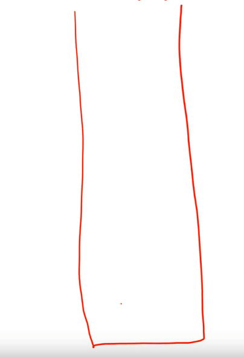

# Lecture 21 - xv6 introduction and x86 background

xv6 is a simple OS used for teaching OS concepts. We shall be using the x86 version of the OS.

An OS enables users to run the processed stored in memory on the CPU.

- It loads the process code/data in main memory.
- CPU fetches, decodes, executes instructions in program code.
- It fetches the process data from memory to CPU registers for faster access during instruction execution (We studied in Arch that memory access is expensive).
- Recently fetched code/data is stored in the CPU in the form of cache for future access.

## Memory Image of a process

The memory image of a process consists of

- Compiled code (CPU instructions)
- Global/static variables (memory allocated at compile time)
- Heap (dynamic memory allocation via, `malloc`, `new` etc) that grows (up) on demand.
- Stack (temporary storage during function calls, e.g., local variables) that usually grows "up" towards lower addresses. It shrinks "down" as memory is freed (exiting function call).
- Other things like shared libraries.

Every instruction/data has an address, used by the CPU to fetch/store (*Virtual addresses* managed by OS). Consider the following example

```cpp
int *iptr = malloc(sizeof(int))
```

Here, `iptr` itself is on stack but it points to 4 bytes (size of `int`) in the heap.

## x86 registers

Registers are a small space for data storage with the CPU. Every CPU architecture has its set of registers used during computation. The names of these registers vary across different architectures. These are the common types of registers:

- General purpose registers - stores data during computations (`eax, ebx, ecx, edx, esi, edi`).
- Pointers to stack locations - base of stack (`ebp`) and top of stack (`esp`).
- Program counter or instruction pointer (`eip`) - Next instruction to execute.
- Control registers - Hold control information or metadata of a process (e.g., `cr3` has pointer to page table of the process). A page table helps the OS to keep track of the memory of the process.
- Segment registers (`cs, ds, es, fs, gs, ss`) - information about segments (related to memory of process).

## x86 Instructions

Every CPU can execute a set of instructions defined in its ISA. The compiled code is written using this ISA so that the CPU can execute these instructions. Here are some common instructions used:

- Load/store  - `mov src, dst` (AT&T syntax - using `src` before `dst`)
  - `mov %eax, %ebx` - copy contents of `eax` to `ebx` 
  - `mov (%eax), %ebx` - copy contents at the address in `eax` into `ebx`
  - `mov 4(%eax), %ebx` - copy contents stores at offset of 4 bytes from address stored at `eax` into `ebx`
- Push/pop on stack - changes `esp` 
  - `push %eax` - push contents of `eax` onto stack, update `esp`
  - `pop %eax` - pop top of stack onto `eax`, update `esp`
- `jmp` sets `eip` to a specified address
- `call` to invoke a function, `ret` to return from a function
- Variants of above (`movw, pushl`) for different register sizes.

## Privilege Levels

x86 CPUs have multiple privilege levels called ***rings*** (0 to 3). Ring 0 has the highest privilege and OS code runs at this level. Ring 3 has the lowest privilege and user code runs at this level. 

There are two types of instructions - privileged and unprivileged. **Privileged** instructions perform sensitive operations which ideally should not be performed by user programs. These can be executed by the CPU only when running at the highest privilege level (ring 0) .

For example, writing into `cr3` register (setting page table) is a privileged instruction. We don't want a user manipulating memory of another process. instructions to access I/O devices is also privileged.

Unprivileged instructions can be run at lower privilege levels. 

>  <span style ="color:red">Even ring 0?</span>

For example, user code running at a lower privilege level can store a value into a general purpose register. 

When a user required OS services (system calls), the CPU moves to higher privilege level and executes OS code that contains privileged instructions. User code cannot invoke privileged instructions directly.

## Function calls and the stack

Local variables and arguments are stored on stack for the duration of a function call.  When a function is called:

- Arguments are pushed onto the stack.
- `call function` -  pushes the return address on stack and jumps to function. That is, `eip` shifts from top of stack to function implementation.
- Local variables are allocated on stack
- Function code is executed
- `ret` - instruction pops return address, `eip` goes back to the old value.

>  <span style ="color:red">What exactly is happening above?</span> 

In this way, stack acts as a temporary storage for function calls.

Before making a function call, we may have to store values of some registers. This is because, registers can get clobbered during a function call.

- Some registers are saved on stack by **caller** before invoking the function (*caller save registers*). The function code (*callee*) can freely change them, and the caller restores them later.
- Some registers are saved by **callee**, and are restored after function ends (*callee save registers*). Caller expects them to have same value on return.
- Return value stored in `eax` register by callee (one of caller save registers)

All of the above is automatically done by the C compiler (C calling convention). Every language has a calling convention that decides which registers have to be classified as caller and callee.

> Caller and Callee both store the registers?

Timeline of a function call is as follows (*Note.* Stack grows up from higher to lower addresses):

- Caller save registers are pushed (`eax, ecx, edx`)
- Arguments of the function are pushed in reverse order onto the stack
- The return address or the old `eip` is pushed on stack by the `call` instruction
- The old `ebp` is also pushed onto the stack
- Set `ebp` to the current top of the stack (base of new "stack frame" of the function)
- Push local variables and callee save registers ()`ebx, esi, edi`). `esp` automatically goes up as you push things onto the stack.
- The function is executed.
- After the function execution, the current stack frame is popped to restore the old `ebp`.
- The return address is popped and `eip` is restored by the `ret` instruction.



Stack pointers: `ebp` stores the address of base of the current stack frame and `esp` stores the address of current top of stack. This way, function arguments are accessible from looking under the stack base pointer.

## C vs. assembly for OS code

Most of xv6 is in C! The assembly code is automatically generated by the compiler (including all the stack manipulations for function calls).

However, small parts of the OS are in assembly language. This is because, the OS needs more controls over what needs to be done in some situations. For example, the logic of switching from stack of one process to stack of another cannot be written in a high-level language.

Therefore, basic understanding of x86 assembly language is required to follow some nuances of xv6 code.

## More on CPU hardware

Some aspects of CPU hardware that are not relevant to studying OS:

- CPU cache - CPU stores recently fetched instructions and data in multiple levels of cache. The operating system has no visibility or control intro the CPU cache.
- Hyper-threading - A CPU core can run multiple processed concurrently via hyper-threading. From an OS perspective, 4-core CPU with 2 hyper-threads per core, and 8-core CPU with no hyper-threading will look the same, even though the performance may differ. The OS will schedule processes in parallel on the 8 available processors.