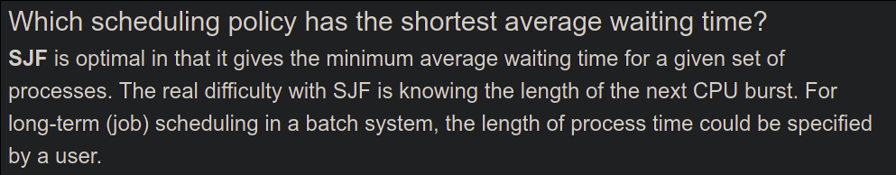

# Lecture 5 - Scheduling Policy

What is a scheduling policy? It is a program that decides which program to run at a given time from the set of ready processes. The OS scheduler schedules the CPU requests (bursts) of processes. **CPU burst** refers to the CPU time used by a process in a continuous stretch. For example, if a process comes back after an I/O wait, it counts as a fresh CPU burst.

Our goal is to maximize CPU utilization, and minimize the **turnaround time** of a process. The turnaround time of a process refers to the time between the process's arrival and its completion. The scheduling policy must also minimize the average **response time**, from process arrival to the first scheduling. We should also treat all processes fairly and minimize the **overhead**. The amortized cost of a context switch is high.

We shall discuss a few scheduling policies and their pros/cons below.

### First-In-First-Out (FIFO)

Schedule the processes as an when they arrive in the CPU. The drawback of this method is the **convoy effect**. In this situation, a process takes high time to execute and effectively increases the turnaround time.

### Shortest Job First (SJF)

This is provably optimal when all processes arrive together. Although, this is a non-preemptive policy.  Short processes can still be stuck behind the long ones when the long process arrives first.

### Shortest Time-to-Completion First

This is a preemptive version of SJF. This policy preempts the running task is the remaining time to execute the process is more than that of the new arrival. This method is also called the Shortest Remaining Time First (SRTF).

> How do we know the running time/ time left of a process? We schedule processes in bursts! No, that's wrong! See this
>
> 

### Round Robin (RR)

Every process executes for a fixed quantum slice. The slice is big enough to amortize the cost of a context switch. This policy is also preemptive! It has a good response time and is fair. Although, it may have high turnaround times.

## Schedulers in Real systems

Real schedulers are more complex. For example, Linux uses a policy called Multi-Level Feedback Queue (MLFQ). You maintain a set of queues and prioritize them. A process is picked from the highest priority queue.  Processes in the same priority level are scheduled using a policy like RR. The priority of a queue decays with its age.

