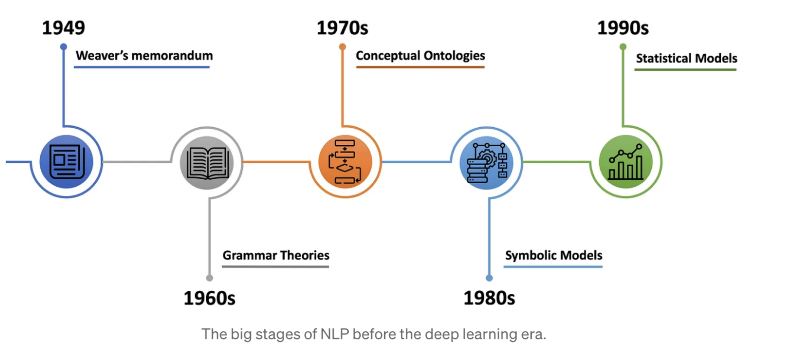
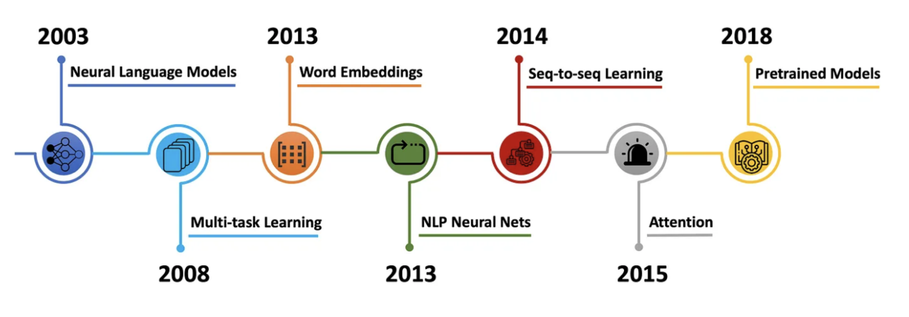
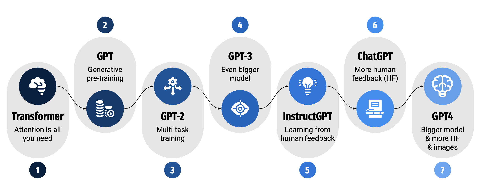
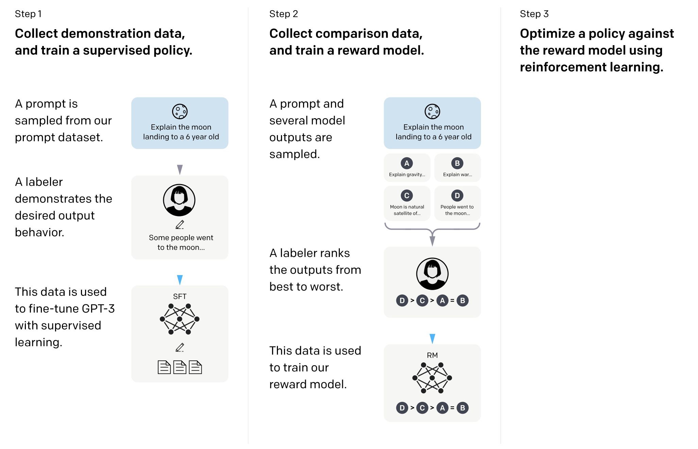

# Introduction

**Natural Language Processing (NLP)** is the study of computer systems that take as input or produce as output natural language - languages created by humans. The goal is to give machines the power to understand not just words, but entire sentences, paragraphs and documents. 

It it worth keeping in mind that the notion of "understanding" is contrived. There is no clear definition - when we claim Large Language Models (LLMs) understand our language, we really don't know if it is understanding. 

NLP develops systems for

2. Analysis of language (NL to some useful output) - text classification, question answering, etc.

3. Generation of language (NL to NL; Image to NL, etc) - summarization, image captioning, machine translation

4. Representation of language (NL to some representation) - learning word embeddings

In the part, systems were task-specific, now we have more general purpose systems capable of all of the above and more.

### Origins

Back in 1949, Warren Weaver, a wartime US mathematician and scientist, brought the idea of the first computer based application related to natural language - machine translation (MT). He considered the problem of translation as a problem in cryptography. We still use the notation of encoder and decoder in the present techniques. He developed a rule-based program to convert Russian to English. 

Over time, it became obvious that human language are **ambiguous** (unlike programming and other formal languages) and they are **rich** - any meaning may be expressed in many ways. Human language interpretation depends on the real world, common sense and **contextual knowledge**. Furthermore, there is **linguistic diversity** across genres, styles, and so more.

In 1957, Chomsky proposed a *generative grammar*, a rule based system of syntactic structures, brought insight into how linguistics can help MT. Since the results were not satisfactory, funding was cut-off and then came the winter of AI in 1966.

In 1971, Terry Winograd's MIT thesis has motivated the notion of **grounded language understanding**. In late 80's, statistical techniques revolutionized NLP. They used early ML algorithms - decision trees with rule based systems. 

From 90's to early 2000s, methods like logistic regression, Support Vector Machines (SVM), Hidden Markov Models (HMMs), Conditional Random Fields (CRFs), etc were introduced. Moreover, papers introduced feature engineering for specific tasks - POS tagging, Named Entity Recognition, Parsing, etc. 

The main language models during this time were n-grams with smoothing.

### Dawn of Deep Learning Era

Bengio et al. in 2003 proposed first neural language models with 1-hidden layer feed-forward neural network. It introduced the notion of **word embeddings** with a real-valued feature vector in $$\mathbb R^d$$. In 2008, a new paper proposed training neural network along with a word embedding matrix jointly. There was no need of feature engineering anymore. 

In 2013, Mikolov et al. introduced arguably the most popular word embedding model - **Word2Vec** - they got rid of hidden layer in the model as well. 

From 2013 to 2018, Recurrent Neural Networks (RNNs; Elman 1990),  Long-Short Term Memory Models (LSTMs), Convolution Neural Networks (CNNs), recursive neural networks (Socher et al.), etc were used for NLP. There were feats of Architectural engineering as well - combining RNNS with CRFs for sequence labeling, CNNs for text classification, summarization with pointer-generators RNNs (2017). *In present date, there are little to no changes in the model architecture.*

In 2014, Google introduced **Sequence-to-sequence** learning, a general end-to-end approach for mapping one sequence to another using a single neural network (encoder-decoder architecture). This proved very important for NLP tasks going forward. It was a fundamental shift in paradigm to perform tasks like translation with a single model instead of complicated designed models. 

Then, in 2015 came the notion of **Attention** - to reduce the bottleneck of sequence-to-sequence models that was compressing the entire content of source sequence into a fixed-size vector. This notion still required sequential processing with RNNs. Finally in 2017, **Transformers** were proposed which eschewed recurrence and relied entirely on attention mechanisms. The parallel nature of the model enabled fast computations.

In 2020, people realized instead of just pre-training the word-embedding layer they could just pre-train the whole network and add a layer-head in the end if required for other specialized tasks. Pre-trained LMs then acted as an initialization for fine-tuning on downstream tasks - ELMo (Peters et al., 2018), ULMFiT (Howard and Ruder, 2018), GPT (Radford et al., 2018), and BERT (Devlin et al,. 2019). The impact of pre-training all the layers was significant.

### Present Date

NLP systems are increasing used in everyday life - in the form of chatbots and other AI assistants. Consider ChatGPT - fastest growing consumer computing applications in history. 

The key advantage os language models is that there is no need of annotation - nearly unlimited training data*. People also realized that using larger and larger models gives higher performance as data scales. The final ingredient to achieve all this is compute - GPU gave a huge advantage over CPU to train these networks. These three key ingredient - hardware scalability (GPUs), Model scalability (Transformer with many deep layers) and Data scalability (Large datasets with lots of text) enabled the success of GPT models. 

Realizing the power of scale, GPT1 was trained with a few million parameters and now GPT4 has a few hundred billion parameters. In 2022, researchers at OpenAI realized some tasks were only possible at larger scales - scaling LMs leads to emergent abilities. Another paper (one of the best papers in NeurIPS) questioned this asking whether this finding is just an artifact of how we designed our metrics. The metrics used in the OpenAI paper did not allow continuous rewards which caused the sudden jump in performance after a certain point in scale. With a more continuous metric, the gains due to scale increase continuously without sudden jumps.

Then came the question of prompting - how do we talk to these LMs? **Prompt** is a cue given to the pre-trained LM to allow it to better understand people's questions (Best paper in NeurIPS 2020). 

GPT3.5 introduced the notion of **Instruction Tuning** - collect examples of (instruction, output) pairs across many tasks and then evaluate on unseen tasks. Furthermore, the output of LMs can be tuned with **Reinforcement Learning with Human Feedback** (RLHF) -  explicitly attempt to satisfy human preferences using RL. This was implemented in an ingenious manner - 

After adding some safety features, GPT3.5 was transformed into ChatGPT. 

**LLM as a reasoning engine** - The knowledge base of LLMs is large but incomplete. To address this limitation, they need to retrieve information from elsewhere, add it to the prompt and then ask the LLM to process it to get an answer. This is the idea behind **Retrieval Augmented Generation (RAG)** for knowledge intensive NLP tasks. The pipeline is more sophisticated, and will be described later.

### Summary

We have the following big picture - 

1. Feature Engineering in 1990s to 2000s

2. Architecture Engineering - 2010 - 2018 (LSTMs, CNNs, Transformers)

3. Objective Engineering - 2018 (ELMo, BERT, GPT)

4. Prompt Engineering - 2020s - present (instruction-tuning, chain-of-thought, etc)

**NLP vs Humans.** General language understanding is still a bit difficult for LLMs

- Sample efficiency - LLMs require a lot of data

- Robustness - LLMs are brittle, can be easily fooled

- Originality - LLMs lack ability to create truly original content

- Causality and other forms of reasoning - LLMs have limited understanding of logic

In the following post, we will start from the basis such as text classification with simple neural networks and make our way to the modern sophisticated techniques being used. Although the initial part of the article may seem very straightforward, it is important to understand the motivations and ideas behind the approaches.

# Text Classification

The task is to assign a text document to one or more categories from a predefined set of labels. For example, Sentiment Analysis, Spam Detection, Topic Classification, Authorship Attribution and Language Identification fall under this domain of tasks.

Unlike tasks like sorting numbers which have clear rules, text classification does not have a standard algorithm. The issues with rule-based algorithms are as follows -

1. Semantic Gap - Computer does not know what words mean - their relationships, sentiment, etc.

2. Intra-class variations - There are many ways to be a particular label.

3. Scalability - Have to write rules for every class label

The task rather requires a data-driven approach (in the form of machine learning) - 

1. Collect a dataset of example text inputs and their labels - **training data**

2. Use Machine Learning algorithms to train a classifier on the training examples

3. Evaluate the classifier of new text data - **test data** - a good classifier generalizes well.

This is the standard process (used to be) to work with machine learning models. Another important aspect with this approach is modeling of data - i.e., input representation. Machine Learning models require numerical input. 

> At their core, machine learning models are optimization models relying on mathematical operations - cannot be done with text data. 

Therefore, we need to create a *feature vector* for the input text for text classification. By creating feature vectors, we are essentially creating another veil of abstraction to reduce the semantic and other complexities in text data.

**Bag of words** is one such early idea that represents text as an unordered collection of words, disregarding grammar and word order. The vector essentially contains the frequency of each word occurring in the training text. For unseen words in test data, we just treat them as a separate entity under the unknown tag.

These feature vectors although being one of the simplest forms of representation have some limitations (owing to the simplicity)

1. Sparsity - high-dimensional, sparse vectors (size of vocabulary)

2. Loss of sentence structure - This context is very important in some tasks

3. Semantic Gap - Lacks the word meanings

### Nearest Neighbor Classifier

The idea is to represent all training examples in a feature space. Given a test instance, we find the closest training example based on a **distance metric** and assign its label to the test instance. This algorithm does not have any training of sorts and takes constant time. However, the inference time is $$\mathcal O(n)$$ since it has to be compared against every test instance. We do not want such behavior with ML models - even if the training is slow, we want the inference to be very fast.

Furthermore, the decision boundaries created by this algorithm are not smooth - *from experience this is a bad outcome, and we ideally want a smooth decision boundary* without too many changes. Motivating from this idea, then came along $$k$$-Nearest Neighbor classification where the nearest $$k$$ neighbors are chosen to decide the label. The parameter $$k$$ is called as a **hyperparameter** that is tuned based on the dataset, model, etc. There is no clear answer as to which hyper-parameter gives the best performance; they have to be chosen empirically. The distance metric and word representation are other hyperparameters in this algorithm. 

Suppose we choose the hyperparameter that works best on the *test data*, it may not perform that well on other test/unseen data. To overcome this, a new split called **validation** is introduced. The hyperparameters are chosen with the validation data and the algorithm is tested on the test data. The golden rule is to run the model on the test set once after everything (training and hyper-parameter tuning) is completed.

The advantages of these models are that they are non-parametric - they make no assumptions about the underlying data. Now, we see another form of classifier that does not have this property.

### Linear classifier

A linear classifier assumes a specific form of the decision boundary - predefined model complexity. These boundaries are defined by a set of fixed parameters - intercept $$b$$ and slope $$m$$. This form of a classifier is still used today in practice.

The mathematical model can be represented as 

$$
y \text{ (label) } = \underbrace{f(x)}_{n \times 1} = \underbrace{W}_{n \times m} \underbrace{x}_{m \times 1} + b
$$

Here, $$n$$ is the number of classes and $$m$$ is the feature dimension. The bias term $$b$$ essentially incorporates prior knowledge into the model.

Linear layers are the building block of **neural networks**. Neural networks consist of small functions that are stacked together to form a complex function, and linear layers are a common building block in these architectures.

How do we find the best $$W, b$$? We define a **loss function** that quantifies our unhappiness with the scores across the training data. This loss function is minimized via **optimization** to get these best values. We typically average the loss function across all the training examples to get the total loss in a training dataset.

Finally, the output from a classifier is unnormalized, and we generally want to interpret these raw scores as probabilities. To normalize the outputs, we use a softmax function - 

$$
P(Y = k, X = x_i) = \frac{e^{s_k}}{\sum_j e^{s_j}}
$$

where $$e$$ is the raw output from the model. This interpretation allows us to now define a loss-function for (binary class) classifiers - **negative log likelihood**. 

$$
L_i = - \log P(y = y_i \vert X = x_i)
$$

Such method of classification is termed as **logistic regression**. 

> For logistic regression, with a small initialization of weights, the expected initial loss is $$\log (# classes)$$. A good sanity check to look out for.

The above loss function is essentially doing **maximum likelihood estimation** on the training data. Given training samples $$(x_i, y_i)$$, the maximum likelihood is given by $$W_{ML} = {\arg \max}_{W \in \mathbb R^{\gamma \times C}} \mathcal L(\bf W)$$. 

The likelihood of the data is given as $$\mathcal L(\bf W) = \sum_{i = 1}^n \log p (Y_i \vert x_i; \bf W)$$. 

### Feed-forward Neural Networks

Neural networks introduce a powerful regime of data-driven methods. These models are essentially linear layers stacked (without the softmax) against one another to form a huge network. Each linear layer is associated with an **activation function** that introduces non-linearity in the models. For example, the linear output $$Wx + b$$ from a linear classifier layer is sent through a sigmoid activation function which essentially maps the input $$x$$ to $$(1 + e^{-x})^{-1}$$. Each weight row in the network is referred to as a **neuron**.

Note that we want our models to generalize well on unseen data. Since neural networks are powerful models, they can *overfit* on the training data to perform really well on the training set but poorly on the test set. Through **regularization**, we prevent overfitting by discouraging the model from fitting the training data too closely. This occurs frequently when in deep and complicated models. With regularization, we are no longer doing Maximum Likelihood Estimation (MLE) with our models. The loss function then becomes

$$
L(W) = \frac{1}{N} \sum_{i = 1}^N L_i (F(x_i, W), y_i) + \lambda R(W)
$$

where $$R(W)$$ is the regularization function and $$\lambda$$ is a *regularization parameter*, and it represents the regularization strength. There are more complex methods like **dropout** and **batch normalization** to prevent overfitting. Dropout refers to *randomly dropping* neurons in the network while training to simplify the model complexity during training time.

With this model, we have described the basic recipe for supervised machine learning!

How do we find the best $$W$$ with these building blocks? Start with a random $$W$$ and iteratively improve it to lower the loss function - **gradient descent**. The size of iterative improvement is given by the **learning rate** - another important hyperparameter.  A small learning rate leads to slower convergence whereas a high learning rate can overshoot the minimum. Typically, the learning rate is changed across training epochs based on a **learning rate schedules** (ex. cosine learning).

The gradient function is pre-computed to prevent recomputing the gradient for every example in practice. **Backpropagation** is a method to compute the gradient of the loss function with respect to the weights in the network - it is an application of the chain rule of calculus.

The naïve version of gradient descent can be optimized much further using better convergence algorithms like ADAM and using stochasticity to descent over batches rather than the whole training dataset to increase speed.

# Word Embeddings and Tokenization

How do we convert words to numerical values? A simple idea is to consider a **one-hot vector** - maps words into fixed length vectors and they contain only the identity information of the object without any semantic information. **Bag-of-words** is essentially the summation of one-hot vectors across the input text.

An interesting result is that word meanings can also be captured through vectors of real numbers - a vector space where similar words (by meaning) have similar vectors (by some distance metric).

