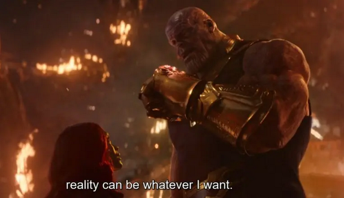

# Lecture 13 `24/08/21`

Forms are in an independent realm. Ideas, a metaphysical concept (?), are being related to epistemological concepts like true knowledge. Check out Plato's cave of reality to better understand his "theory of ideas".

Plato's ideology in a nutshell:

I give up writing notes for this lec.