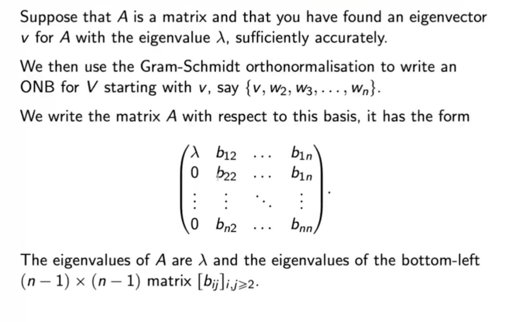

# MA214 post-midsem notes

- **Composite numerical integration** - Newton-Cotes doesn’t work for large intervals. Therefore, we divide the interval into sub-parts. We are essentially doing a spline sorta thing instead of a higher degree polynomial.
  $$
  \begin{align}
  \int_a^b f(x)dx &= \sum_{j = 1}^{n/2} \left\{\frac{h}{3}[f(x_{2j - 2} + 4f(x_{2j - 1} + f(x_{2j}] - \frac{h^5}{90}f^{(4)}(\xi_j)\right\} \\
  &= \frac{h}{3}\left[f(a) + 2\sum_{j = 1}^{n/2 - 1}f(x_{2j}) + 4\sum_{j = 1}^{n/2}f(x_{2j - 1}) + f(b)\right] - \frac{b - a}{180}h^4f^{(4)}(\mu)
  \end{align}
  $$
  
- Error in composite trapezoidal rule is $$\frac{b - a}{12}h^2f''(\mu)$$, and in composite Simpson’s rule is $$\frac{b - a}{180}h^4f''(\mu)$$.

- The round-off error does not depend on the number of calculations in the composite methods. We get
  $$
  e(h) \leq hn\epsilon = (b - a)\epsilon
  $$
  Therefore, integration is stable.

- **Adaptive Quadrature method** - 
  $$
  S(a, b) - \frac{h^5}{90}f^{(4)}(\xi) \approx S(a, \frac{a+ b}{2}) + S(\frac{a + b}{2}, b) - \frac{1}{16}\frac{h^5}{90}f^{(4)}(\xi')
  $$
  **We will assume $$f^{(4)}(\xi) \approx f^{(4)}(\xi’)$$.** Using this assumption, we get that composite Simpson’s rule with $$n = 2$$ is **15** times better than normal Simpson’s rule. If one of the subintervals has error more than $$\epsilon/2$$, then we divide it even further.

  > Check this properly!

- **Gaussian Quadrature method** - 

  Choose points for interval in an optimal way and not equally spaced. We choose $$x_i$$ and $$c_i$$ to minimise the error in
  $$
  \int_a^bf(x)dx \approx \sum_{i = 1}^nc_if(x_i)
  $$
  There are $$2n$$ parameters, then the largest class of polynomials is the set of polynomials with degree $$2n - 1$$ for the approximation to be exact.

  **Note.** Work with special cases of polynomials like $$1, x, x^2, \dots$$ to get the values of the coefficients easily. (because all polynomials in the set must satisfy the approximation)

  **Legendre polynomials** - There exist polynomials $$\{P_n(x)\}$$ for $$n = 0, 1, \dots$$satisfying

  - $$P_n(x)$$ is a monic polynomials
  - $$\int_{-1}^1P(x)P_n(x) = 0$$ whenever the degree of $$P(x)$$ is less than $$n$$.

  For example, $$P_0(x) = 1, P_1(x) = x$$. $$P_2$$ can be computed from $$P_0$$ and $$P_1$$ as $$\int P_0P_2$$ and $$\int P_1P_2$$ are 0.

  

- **Multidimensional integrals** - Composite trapezoidal rule has square of the number of function evaluations required for a single integral (for 2D).

  

  > See if problems to be practiced here.

- **Improper integrals** - Function is unbounded or the interval is unbounded. We will deal with functions where the function is unbounded on the left end. 

- > ***Aside.*** $$a^b$$ is defined as $$\exp(b \log a)$$ in the complex domain. $$\log$$ is not defined as the inverse of $$\exp$$ as $$\exp$$ is neither surjective (doesn’t take the value 0) nor injective (periodic in $$\mathbb C$$). $$\exp$$ is defined by the power series and so is $$\log$$. The solution set of $$z$$ for $$e^z = w$$ where $$z, w \in \mathbb C$$ is given by
  > $$
  > \{\log |w| + \iota(\arg w + 2\pi k) : k \in \mathbb Z\}
  > $$

  If $$f(x) = \frac{g(x)}{(x - a)^p}$$ where $$0 < p< 1$$ and $$g: [a,b] \to \mathbb R$$ is continuous then the improper integral $$\int_a^b f(x)dx$$ exists. Assume $$g$$ is 5-times continuously differentiable. We can estimate the integral of $$f(x)$$ using the following

  - Get $$P_4(x)$$ which is the 4th degree Taylor’s polynomial of $$g$$.
  - Get the **exact** value of $$\int_a^b P_4(x)/(x - a)^p$$.
  - Get the value of the difference by defining the value at $$z = a$$ as $$0$$ using composite Simpson’s rule.

  > Why can’t we do Simpson’s on everything? That would lead to a similar thing. *Think*. Also, we require 4 times continuously differentiable for Simpson’s

  The other type of improper integral involves infinite limits of integration. The basic integral is of the type $$\int_a^\infty 1/x^p dx$$ for $$p > 1$$. Then, we substitute $$x = 1/t$$ and proceed. 

- ***Ordinary Differential Equations*** We shall develop numerical methods to get solutions to ODEs at a given point. Then, we can use interpolation to get an approximate continuous solution.

  A function $$f(t, y)$$ is said to satisfy a **Lipschitz condition** in the variable $$y$$ on a set $$D \subset \mathbb R^2$$ if a constant $$L > 0 $$ exists with 
  $$
  \mid f(t, y_1) - f(t, y_2) \mid \leq L\mid y_1 - y_2 \mid
  $$
  

  IVP is well-posed if it has a unique solutions, and an IVP obtained by small perturbations also has a unique solution. We consider IVPs of the form $$dy/dt = f(t, y)$$, $$a \leq t \leq b$$, $$y(a) = \alpha$$.

  

-  **Euler’s method** - We generate *mesh points* and interpolate. As we are considering IVPs of a certain form, we can just use 1st degree Taylor’s polynomial to approximate the solution to the IVP. We take $$q_0 = \alpha$$ and $$w_{i + 1} = w_i + hf(t_i, w_i)$$ for $$i \geq 0$$ where $$w_i \approx y(t_i)$$. The error grows as $$t$$ increases, but it is controlled due to the stability of Euler’s method. It grows in a linear manner wrt to $$h$$. 

- <u>Error in Euler’s method</u> - Suppose $$\mid y''(t) \mid \leq M$$, then $$\mid y(t_i) - w_i \mid \leq \frac{hM}{2L}(\exp (L(t_i - a)) - 1)$$. What about round-off errors? We’ll get an additional factor of $$\delta/hL$$ in the above expression along with the constant $$\delta_0 \exp (L(t_i - a))$$. Therefore, $$h = \sqrt(2\delta/M)$$.

- **Local truncation error** - **$$\tau_{i + 1}(h) = \frac{y_{i + 1} - y_i}{h} - \phi(t_i, y_i)$$.** It is just $$hM/2$$ for Euler’s method ($$\phi$$ refers to the Taylor polynomial). We want truncation error to be as $$\mathcal O(h^p)$$ for as large $$p$$ as possible. 

  **Higher order Taylor methods** - Assume $$f$$ is $$n$$-times continuously differentiable. We get $$\mathcal O(n)$$ for $$n$$th degree Taylor polynomial. However, the number of computations are a bit high.

  > Practice problems on this

- What about interpolation? We should use cubic Hermite interpolation (to match the derivative too).

- Now, we try to reduce the computation of higher order derivatives. **Runge-Kutta methods** - Based off Taylor’s theorem in two variables. 

  

  Order 2- We get $$a = 1, \alpha = h/2, \beta = f(t, y)h/2$$ by equating $$af(t + \alpha, y + \beta)$$ to $$T(t, y) = f(t, y) + h/2 f'(t, y)$$. This specific Runge-Kutta method of Order 2 is known as the **midpoint-method**. (2D of Taylor order 2) 
  $$
  w_{i + 1} = w_i + hf\left(t_i + \frac{h}{2}, w_i + \frac h 2 f(t_i, w_i)\right)
  $$
  The number of nesting $$f$$‘s represents the order of the differential equation.

  Suppose we try the form $$a_1f(t, y) + a_2 f(t + \alpha_2, y + \delta_2 f(t, y))$$ containing 4 parameters to approximate. We still get $$\mathcal O(n^2)$$ as there is only one nesting. 

- However, the flexibility in the parameters allows us to derive the **Modified Euler method**. 
  $$
  w_{i + 1} = w_i + \frac h 2[f(t_i, w_i) + f(t_{i + 1}, w_i + hf(t_i, w_i))]
  $$
  **Higher-order Runge-Kutta methods** - The parameter values are used in the **Heun’s method**.

  

  The most common Runge-Kutta is order 4 whose local truncation error is $$\mathcal O(n^4)$$.

  

- <u>Error control in Runge-Kutta methods</u>. Adaptive step size for lower error. Single step approximation - uses $$i-$$ for $$i$$. Given an $$\epsilon > 0$$, we need to be able to give a method that gives $$\mid y(t_i) - w_i\mid < \epsilon$$. 
  $$
  y(t_{i + 1}) = y(t_i) + h\phi(t_i, y(t_i), h) + \mathcal O(h^{n + 1}) \\
  $$
  Local truncation error assumes $$i$$th measurement is correct to find error in the $$i + 1$$th measurement. We get
  $$
  \tau_{i + 1}(h) \approx \frac 1 h (y(t_{i + 1}) - w_{i + 1})
  $$
  assuming $$y_i \approx w_i$$. For $$n$$th degree truncation error, we get $$\tau_{i + 1}(h) \approx \frac 1 h (w^{n + 1}_{i + 1} - w^{n}_{i + 1})$$. After a few approximations, we get that the local truncation error changes by a factor of $$q^n$$ when the step size changes by a factor of $$q$$.

- **Runge-Kutta-Fehlberg Method** - It uses a Runge-Kutta method with local truncation error of order five. We change the step size if $$q < 1$$. These methods are just an analogue of adaptive quadrature methods of integrals.

- **Multi-step methods**. Methods that use the approximation at more than one previous mesh point to determine the approximation at the next point. The general equation is implicit where $$w_{i + 1}$$ occurs on both sides of the equation. Implicit methods are more accurate than explicit methods.

  

- **Predictor-Corrector Method** - How do we solve implicit methods? We can use the root-finding procedures we learnt. All of this can get quite cumbersome. We just use implicit methods to improve the prediction of the explicit methods. We insert the solution of explicit method (prediction) and insert it on the rhs of the implicit method (correction). 

- **Consistency and Convergence** 

  One-step difference method is **consistent** if $$\lim_{h \to 0}\max_{1 \leq i \leq n}\mid \tau_i(h)\mid = 0$$. But we also need the global measure - **convergence** - $$\lim_{h \to 0}\max_{1 \leq i \leq n}\mid y_i(t_i) - w_i\mid = 0$$

  **stability** considering round-off errors. For the function $$\phi$$ satisfying Lipschitz condition with a $$h_0$$, the one-step difference method **is convergent iff it is consistent**. The local truncation error is bounded, and we get $$\mid y(t_i) - q_i \mid \leq \frac {\tau(h)}{L}e^{L(t_i - a)}$$.
  
  Analysis of consistency, convergence, and stability is difficult for multi-step methods. Adams-* methods are stable.
  
- ***Numerical Linear Algebra*** - Basics - $$Ax = b$$ has a unique solution iff $$A$$ is invertible, and it does not have a unique or has no solution otherwise. 

  **Cramer’s rule** - $$x_j = \frac{\det A_j}{\det A}$$. However, this is cumbersome. Determinant of an upper triangular matrix    is product of the diagonal entries.

  **Gaussian Elimination Method** - $$A = LU$$ for most matrices $$A$$. $$L$$ is a lower triangular matrix and $$U$$ is an upper triangular matrix. Form the augmented matrix $$[ A \mid b] $$. Linear combination of rows and swapping of rows can be performed. What is the total number of arithmetic operations?
  
  For converting to triangular -  We use $$(n - i)$$ divisions for each row and $$(n - i + 1)$$ multiplications for each column of each row. Also, we have $$(n - i)(n - i + 1)$$ subtractions. In total, we have $$(n - i)(n - i + 2)$$ multiplications. Summing, we get $$\mathcal O(n^3)$$ multiplications ($$(2n^3 + 3n^2 - 5n)/6$$) and subtractions $$((n^3 - n)/3)$$.
  
  For back substitution - multiplication is $$(n^2 + n)/2$$ and subtraction is $$(n^2 - n)/2$$.
  
- We have not considered finite digit arithmetic for GEM previously. The error dominates the solution when the pivot has a low absolute value. In general, we need to ensure that the pivot does not have very low magnitude by interchanging rows (followed by interchanging columns for triangular form if needed) - **partial pivoting**. However, this might not be enough to get rid of the rounding error. Therefore, we need to consider **scaled partial pivoting**. Define $$s_i$$ as the maximum magnitude in the $$i$$th row. Now, the first pivot is chosen by taking the row with the maximum value of $$a_{i1}/s_i$$. The operation count order still remains the same. You need not calculate scale factors more than once.

- **LU Decomposition** - The conversion of $$A$$ to a triangular form using the above method can be represented as a sequence of matrix multiplications (if $$A$$ does not require any row interchanges). The inverse of a  matrix depicting operations on $$A$$ can be seen a matrix depicting the same inverse operations on $$A$$. In the end, we get $$A = (L^{(1)} \dots L^{(n - 1)})(M^{(1)}\dots M^{(n-1)}A)$$ where each $$M^{(i)}$$ represents the action that uses $$A_{ii}$$ as a pivot. Once we get $$L$$ and $$U$$, we can solve $$y = Ux$$ and $$Ly = b$$ separately. There are multiple decompositions possible which are eliminated by imposing conditions on the triangular matrices. One such condition is setting $$L_{ii} = U_{ii}$$ which is known as *Cholesky Decomposition*.

  We had assumed that row interchanges are not allowed. However, we can build **permutation matrices** for row interchanges which will be of the form of an identity matrix with row permutations.

  Therefore, we get **PLU decomposition**.
  
- **Diagonally dominant matrices** - An $$n \times  n$$ matrix $$A$$ is said to be diagonally dominant when $$\mid a_{ii} \mid \geq \sum^n \mid a_{ij} \mid $$ for all rows. <u>A strongly diagonally dominant matrix is invertible</u>. Such matrices will not need row interchanges, and the computations will be stable wrt the round off errors.

  > Why this instead of $$\mid a_{ii} \mid \geq \max \mid a_{ij} \mid $$

  A matrix $$A$$ is **positive definite** if $$x^tAx > 0$$ for every $$x \neq 0$$. We shall also consider $$A$$ to be symmetric in the definition. Every positive definite matrix is invertible, $$A_{ii} > 0$$ for each $$i$$,  $$(A_{ij})^2 < A_{ii}A_{jj}$$, and $$\max_{1\leq k, j \leq n} \mid A_{kj} \mid \leq \max_{1 \leq i \leq n}\mid A_{ii}\mid$$.
  
  A **leading principal submatrix** of matrix $$A$$ is the top-left $$k \times k$$ submatrix of $$A$$. $$A$$ <u>is positive definite iff each leading principal submatrix of</u> $$A$$ <u> has a positive determinant.</u> 
  
  Gaussian Elimination on a symmetric matrix can be applied without interchanging columns iff the matrix is positive definite.
  
  A matrix $$A$$ is positive definite iff $$A = LDL^t$$ where $$L$$ is lower triangular with 1’s on the diagonal and $$D$$ is a diagonal matrix with positive diagonal entries. Alternatively, $$A$$ is positive dfinite iff $$A = LL^t$$ where $$L$$ is a lower triangular matrix. **Note.** Positive definite is stronger than Cholesky decomposition.
  
- We have been seeing direct methods for solving $$Ax = b$$. We shall see some iterative methods now. We need a distance metric to check the closeness of the approximation. We will consider $$l_2$$ distance = $$\| x - y\|_2 = \left( \sum_{i = 1}^n (x_i - y_i)^2 \right)^{1/2}$$ and $$l_\infty$$ distance  = $$\| x - y\|_2 = \max_{i = 1}^n \mid x_i - y_i \mid$$. Also, $$\|x - y\|_\infty \leq \|x - y\|_2 \leq \sqrt n\|x - y\|_\infty$$.  We also need to consider distances in matrices.

- **Distances in Matrices** - $$\|A\|_2 = \max_{\|x\|_2 = 1} \|Ax\|_2$$ and $$\|A\|_\infty = \max_{\|x\|_\infty = 1} \|Ax\|_\infty$$. The $$l_\infty$$ can be directly calculated using $$\|A\|_\infty = ]max_{i} \sum_j \mid A_{ij} \mid$$. 

- **eigenvalues, eigenvectors** - A **non-zero** vector $$v \in \mathbb R^n$$ is an eigenvector for $$A$$ if there is a $$\lambda \in \mathbb R$$ such that $$Av = \lambda v$$ and $$\lambda \in \mathbb R$$ is the eigenvalue. The **characteristic polynomial** of $$A$$ is $$\det(A - \lambda I)$$. We do not consider the complex roots that are not real for these polynomials to calculate eigenvalues.

  **Spectral radius** - $$\rho(A) = \max \mid \lambda \mid$$. Then, we have the relation that $$\|A\|_2 = [\rho(A^tA)]^{1/2}$$ and also $$\rho(A) \leq \|A\|_2$$ and $$\rho(A) \leq \|A\|_\infty$$. 
  
  **Convergent matrices** - It is of particular importance to know when powers of a matrix become small, that is, when all the entries approach zero. An $$n \times n$$ matrix $$A$$ is called convergent if for each $$1 \leq i, j \leq n$$, $$\lim_{k \to \infty}(A^k)_{ij} = 0$$.
  
  - $$A$$ is a convergent matrix
  - $$\lim_{n \to \infty} \|A^n\|_2 = 0$$
  - $$\lim_{n \to \infty} \|A^n\|_\infty = 0$$
  - $$\rho(A) < 1$$
  - $$\lim_{n \to \infty} A^nv =0 $$ for every vector $$v$$.
  
  The above statements are all equivalent.
  
- Iterative techniques are not often used for smaller dimensions. We will study **Jacobi** and the **Gauss-Seidel** method.

  **Jacobi Method** - We assume that $$\det(A)$$ being non-zero (as matrix must be invertible for solution) and the diagonal entries of $$A$$ are also non-zero. We have
  
  Jacobi suggested that we start with an initial vector $$x^{(0)} = [x_1^{(0)}, \dots, x_n^{(0)}]$$ and for $$k \geq 1$$
  
  
  $$
  x_i^{(k)} = \frac{b_i - \sum_{j \neq i} a_{ij}x_j^{(k - 1)}}{a_{ii}}
  $$
  
  
  The error in the iterations is given by
  
  
  $$
  \mid x_i - x_i^{(k)} \mid \leq (\sum_{j \neq i} \frac{a_{ij}}{a_{ii}})\|x_j - x_j^{(k - 1)}\|_\infty
  $$
  
  
  which gives
  
  
  $$
  \| x - x^{(k)} \|_\infty \leq (\max_i \sum_{j \neq i} \frac{a_{ij}}{a_{ii}})\|x_j - x_j^{(k - 1)}\|_\infty
  $$
  
  
  If $$\mu = \max{i}\sum_{j \neq i} \frac{a_{ij}}{a_{ii}} < 1$$, then convergence is guaranteed. If $$\mu < 1$$, then the condition is nothing but that of strictly diagonally dominant matrices.
  
  **Gauss-Seidel method** - The idea is that once we have improved one component, we use it to improve the component of the next component and so on.
  
  
  $$
  x_i^{(k)} = \frac{1}{a_{ii}} \left[b_i - \sum_{j = 1}^{i - 1}a_{ij}x_j^{(k)} - \sum_{j = i + 1}^n a_{ij}x_j^{(k - 1)}\right]
  $$
  
  
  There are linear systems where Jacobi method converges but Gauss-Seidel method does not converge. If $$A$$ is strictly diagonally dominant, then both methods converge to the true solution.
  
- **Residual vector** - If $$\tilde x$$ is an approximation to $$Ax = b$$, then $$r = b - A\tilde x$$ is the residual vector. However, it is not always true that when $$\|r \|$$ is small then $$\|x - \tilde x\|$$ is also small. This is because $$r = A(x - \tilde x)$$, and that represents the affine transformation of space. This phenomenon is captured as follows

  For a non-singular $$A$$, we have
  
  
  $$
  \|x - \tilde x\|_\infty \leq \|r \|_\infty \cdot \|A^{-1}\|_\infty
  $$
  
  
  If $$x \neq 0$$ and $$b \neq 0$$
  
  
  $$
  \frac{\|x - \tilde x \|_\infty}{\|x\|_\infty} \leq \|A\|_\infty\cdot \|A^{-1}\|_\infty \cdot \frac{\|r\|_\infty}{\|b\|_\infty}
  $$
  
  
  These relations work for $$l_2$$ norm too. 
  
  > I think $$\|A\|_\infty \|x\|_\infty \geq \|b\|_\infty$$
  
  The **condition number** of a non-singular matrix $$A$$ is 
  
  
  $$
  K(A) = \|A\|_\infty \cdot \|A^{-1}\|_\infty
  $$
  
  
  Also, $$\|AA^{-1}\|_\infty \leq \|A\|_\infty \|A^{-1}\|_\infty$$. A non-singular matrix $$A$$ is said to be **well-conditioned** if $$K(A)$$ is close to 1.
  
  However, the condition number depends on the round-off errors too. The effects of finite-digit arithmetic show up in the calculation of the inverse. As the calculation of inverse is tedious, we try to calculate the condition number without the inverse. If we consider $$t$$-digit arithmetic, we approximately have
  
  
  $$
  \|r\|_\infty \approx 10^{-t}\|A\|_\infty \cdot \|\tilde x \|_\infty
  $$
  
  
  One drawback is that we would have to calculate $$r$$ is double precision due to the above relation. The approximation for $$K(A)$$ comes from $$Ay = r$$.  Now, $$\tilde y \approx A^{-1}r = x - \tilde x$$. Then, 
  
  
  $$
  \|\tilde y\| \leq \|A^{-1}\|  \cdot (10^{-t}\cdot \|A\| \|\tilde x\|)
  $$
  
  
  Using the above expression, we get 
  
  
  $$
  K(A) \approx \frac{\|\tilde y\|}{\|\tilde x\|}10^t
  $$
  
  
  The only catch in the above method is that we need to calculate $$r$$ in $$2t$$-finite arithmetic.
  
  **Iterative refinement** - As we had defined $$\tilde y = x - \tilde x$$, in general, $$\tilde x + \tilde y$$ is more accurate. This is called as iterative improvement. If the process is applied using $$t$$-digit arithmetic and if $$K(A) \approx 10^q$$, then after $$k$$ iterations, we have approximately $$\min(t, k(t - q))$$ correct digits. When $$q> t$$, increased precision must be used.
  
- **Approximations for eigenvalues**

  **Gerschgorin theorem** - We define discs $$D_i = \left\{ z \in \mathbb C: \mid z - a_{ii} \mid \leq \sum_{j \neq i} \mid A_{ij} \mid \right\}$$. Then, all eigenvalues of $$A$$ are contained in the union of all the disks $$D_i$$. The union of any $$k$$ of the disk that do not intersect the remaining $$n - k$$ disks contains precisely $$k$$ of the eigenvalues including the multiplicity. From this theorem, we get that strictly diagonally dominant matrices are invertible. This is also true for strictly diagonally column dominant matrices. 
  
  The above theorem provides us the initial approximations for the eigenvalues. We shall see the Power method.
  
  **Power method** - We assume $$\mid \lambda_1 \mid > \mid \lambda_2 \mid \geq \dots \geq \mid \lambda_n \mid$$, and that $$A$$ has $$n$$ linearly independent eigenvectors. Choose a non-zero $$z \in V$$, and compute 
  
  
  $$
  \lim_{k \to \infty} A^k z
  $$
  
  
  to get the eigenvalue! (Think of vector space transformations geometrically).
  
  If $$z = \sum \alpha_i v_i$$, we get
  
  
  $$
  A^k z = \lambda^k_1 \alpha_1 v_1 + \dots + \lambda^k_n \alpha_n v_n = \lambda_1^k \alpha_1 v_1
  $$
  
  
  for high values of $$k$$. 
  
  Sometimes, $$z$$ may not have the component of $$v_1$$. We choose a vector such that this is not the case. 
  
  Sometimes, it may also be the case that
  
  $$\mid \lambda_1 \mid \geq \mid \lambda_2 \mid \geq \dots > \mid \lambda_n \mid > 0$$. $$A$$ is invertible iff this holds. Then, we use the power method on $$A^{-1}$$.
  
  Sometimes, $$\mid \lambda_1 \mid < 1$$ and we’ll converge to 0. On the other hand, if it is more than 1, the limit will shoot to infinity. To take care of these, we scale $$A^k(z)$$, so that it is finite and non-zero. 
  
  Firstly, we choose $$z$$ such that $$\|z^{(0)}\| = 1$$ and we choose a component $$p_0$$ of $$z^{(0)}$$ such that  $$\mid z_{p_0}^{(0)} \mid = 1$$. Following this, we scale each subsequent value as follows - Let $$w^{(1)} = Az^{(0)}$$ and $$\mu^{(1)} = w_{p_0}^{(1)}$$.
  
  
  $$
  \mu^{(1)} = \lambda_1 \frac{\alpha_1(v_1)_{p_0} + \dots + (\lambda_n/ \lambda_1) \alpha_n (v_n)_{p_0}}{\alpha_1(v_1)_{p_0} + \dots + \alpha_n (v_n)_{p_0}}
  $$
  
  
  Now, we choose $$p_1$$ to be the least integer with $$\mid w_{p_1}^{(1)}\mid = \|w^{(1)}\|$$ and define $$z^{(1)}$$ by 
  
  
  $$
  z^{(1)} = \frac{1}{w_{p_1}^{(1)}} Az^{(0)}
  $$
  
  
  Then, in general,
  
  
  $$
  \mu^{(m)} = w_{p_{m - 1}}^{(m)}  = \lambda_1 \frac{\alpha_1(v_1)_{p_0} + \dots + (\lambda_n/ \lambda_1)^m \alpha_n (v_n)_{p_0}}{\alpha_1(v_1)_{p_0} + \dots + (\lambda_n/ \lambda_1)^{m - 1}\alpha_n (v_n)_{p_0}}
  $$
  
  
  Now, $$\lim_{m \to \infty} \mu^{(m)} = \lambda_1$$. 
  
  
  
  To find other eigenvalues, we use **Gram-Schmidt orthonormalisation**. 
  
  
  
  

---

#### END OF COURSE

---

