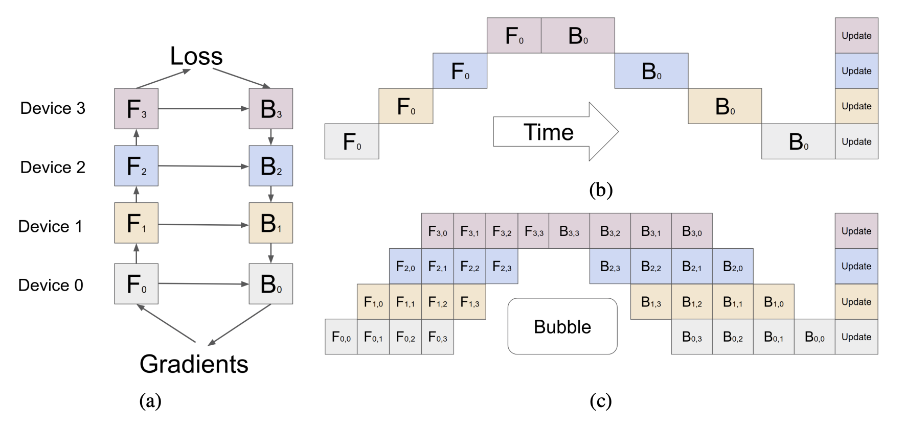
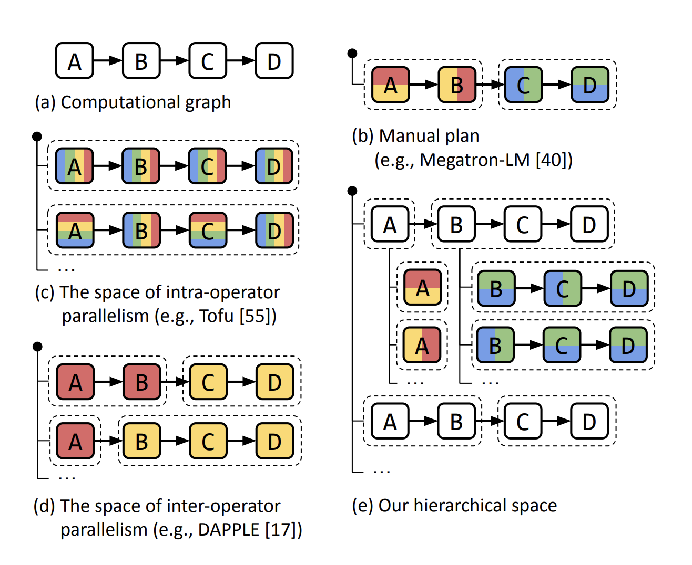
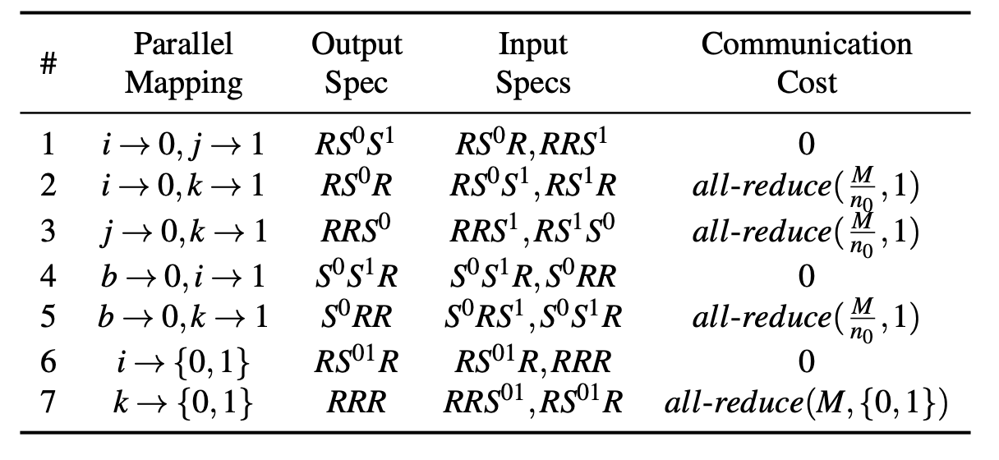

# [GPipe](https://arxiv.org/pdf/1811.06965)

GPipe is an attempt to democratize model parallelism through pipeline algorithms for layered networks. It was proposed towards the end of 2018, when transformers started getting popular and the hardware could not catch up. The high-level idea is that each model can be specified as a sequence of layers and consecutive groups of layers can be partitioned into cells that are each placed on a separate accelerator. A novel pipeline parallelism algorithm with micro-batch splitting is used to maximize the utility of the hardware. 

It was released to the public as an open-source library. The interface consists of user-selectable parameters such as estimate of the computation cost $$C_k$$, number of partitions $$K$$, number of micro-batches $$M$$, and layers $$L$$ that define the model etc. 

GPipe is a synchronous pipeline based parallelism technique. There are other approaches that split the operators across the accelerators (GPipe splits the layers), akin to SIMD approach for data parallelism. They call this the Single Program Multiple Data (**SPMD**) paradigm, and Mesh-Tensorflow is one method existing at that time. They note that these methods have high communication overhead and there are variety of ways of splitting the operators some of which may not be generalizable or scalable. Along similar lines, PipeDream pipelines the execution of forward passes and intersperses them with backward passes to maximize hardware utilization. However, it suffers from update staleness introduced by asynchronous backward updates. Some versions suggested maintaining multiple versions of the model, but that greatly hampers the scaling abilities of the technique. 

## Algorithm

GPipe partitions the network into $$K$$ sequential cells and each of them are placed on the available devices. Communication primitives are inserted at the boundaries to allow data transfer. The partitions are split so that the variance across all the cells is minimized to sync the computation time across all partitions. 

During the forward pass, every mini-batch of size $$N$$ is split into $$M$$ micro-batches that are pipelined through $$K$$ accelerators. During the backward pass, gradients for each micro-batch are computed with the weights used for the forward pass, and these gradients are accumulated to update the model parameters across all accelerators. 

For batch-normalization layers, the statistics of inputs across micro-batches and moving averages across the mini-batch are calculated and communicated. 

To further decrease the memory consumption, GPipe supports gradient checkpointing - each accelerator only stores the output activates at the partition boundaries. As a result, the peak activation memory is reduced to $$O(N + \frac{L N }{KM})$$ from $$O(NL)$$ (without gradient checkpointing and partitioning) where $$N/M$$ is the micro-batch size and $$L/K$$ is the number of layers per partition. 

The bubble overhead with this method is $$O(\frac{K - 1}{M + K - 1})$$ amortized over the number of micro-steps $$M$$. It is negligible in practice when $$M \geq 4\times K$$. Note that increasing the number of micro-batches would underutilize the GPUs. 

GPipe has low communication overhead allowing efficient scaling on accelerators without high-speed interconnects. However, the memory requirements and computation flops at different layers are usually very imbalanced leading to inefficiencies. The authors left this problem of better partitioning algorithms to future works.  

## Results and Conclusion

GPipe is able to reduce the memory requirements by half allowing training of almost 25x larger models. These savings are even more significant with architectures such as transformers where the savings can be 250 times. The speed-up is almost linear barring the pipeline bubbles and communication overheads. They obtained significant savings even with a low-speed communication device (PCI-E vs NVLink). 

These savings translate into the model performance as well. Giant networks can improve the accuracy, also allowing models to be trained on larger datasets.  The authors tests this hypothesis with image classification and machine translation tasks. This work opened new avenues to analyze model architectures such as studying depth-width trade-offs in transformers (the deeper model outperforms by huge margins on low-resource languages, suggesting that it may be better for generalization). 

They also tested higher batch sizes that were not possible previously, and they observed that larger batch sizes improved the performance!

GPipe assumes that a single layer fits within the memory requirements of a single accelerator and some layers (such as batch norm) require complicated computations and communications across accelerators which have been solved by future works. 

# [Alpa - Automated Parallelism](https://arxiv.org/pdf/2201.12023)

A given model can be parallelized in many ways. There are intra-operation and inter-operation splitting mechanisms that need to be considered based on the model architecture and the underlying hardware. These choices are interdependent, and it is difficult to consider all the variations to manually find the best way to parallelize every time. 

Alpa automates model-parallel training of deep-learning models by generating execution plans that unify data, operation and pipeline parallelism! They observed that all the parallelization techniques can be organized in a hierarchical space and be mapped to the hierarchical structure of the compute cluster. Different parallelization techniques have different bandwidth requirements for communication. On this note, they consider two types of parallelization

1. **Intra-operator parallelism** - Partition ML operators along one or more tensor axes (batch or non-batch) and dispatch the partitions across the devices. Note that it involves data parallelism as well.
   
   Intra-operator parallelism has better device utilization, but results in communicating at every split and merge of partitioned operators in each training iteration.

2. **Inter-operator parallelism** - Slice the model into disjoint stages and pipeline the execution of stages on different devices. 
   
   Inter-operator parallelism only requires communication between adjacent stages which can be light if sliced efficiently. However, it results in device idle time due to pipeline bubbles as we discussed before. 

Parallel to these tradeoffs, the communication bandwidth on the device cluster also has an asymmetric nature. The intra-operator parallelism can use the high communication bandwidth, while the inter-operator parallelism is handled between distance devices with relatively lower bandwidth. The joint execution plan may not be globally optimal, it obtains high performance across different large models. 

Alpa essentially is a compiler for parallel execution plans  that partitions the cluster into device meshes based on the bandwidth hierarchy and performs inter-operator and intra-operator splitting. 

## Background

As mentioned previously, the authors consider a new view of ML parallelism that differs from the conventional views. Previously, the parallelism was one of the following types

1. Data parallelism - Data is distributed, but the model is replicated. The parameter updates are synchronized before the next iteration.

2. Operator parallelism - When the models are too large to fit in a device, the operators involved are split across the non-batch axes and the computations are performed in parallel across devices. This method usually requires large amount of communication across devices. When the tensors are partitioned evenly, i.e., SPMD, all devices follow the same communication patterns.

3. Pipeline parallelism - The model is split into stages which are placed on different workers. The training batch is split into microbatches for overlapped iterations of forward and backward passes across workers. 

4. Hybrid parallelism - Researchers manually combined the above techniques to obtain much higher performance. One notable work is the Megatron-LM that optimizes the parallelization for transformer models (3D Parallelism). 

5. Automatic combination of parallelism - Prior to this work, auto-parallelization was limited to combining data parallelism with at most one model parallelism approach missing improvement opportunities. 

In contrast to this view, the authors consider inter-op and intra-op parallelisms as described before. With such a view, techniques such as Megatron-LM, ZeRO (that involves updates sharding) can be viewed as intra-op parallelism. On the other hand, techniques such as GPipe, 1F1B and PipeDream are all pipeline optimizations that come under inter-op parallelism. The authors of this paper adopt synchronous 1F1B for pipeline parallelism. 

## Method Overview

As mentioned previously, Alpa considers two-level planning

1. At the intra-op level, minimize the cost of executing a stage of the computational graph on a given device mesh (that have high bandwidth between each other)

2. At the inter-op level, minimize the inter-op parallelization latency with respect to slicing the model and mapping the stage-mesh pairs. The inter-op optimization depends on knowing the execution cost of each stage-mesh pair reported by the intra-op optimizer.

Alpa does this by generating an intermediate representation similar to Jax which is used by the optimization steps. 

A device mesh is a 2-dimensional logical view of a set of physical devices (all having same compute capability) which communicate with different bandwidths in each dimension. We will delve deeper into the two stages below.

## Intra-operator Parallelism

Alpa adopts the SPMD-style intra-op parallelism that partitions operators evenly across devices and executes the same instructions on all devices assuming that the devices in the mesh have equivalent compute capability. This decision greatly reduces the search space and unifies approaches such as data parallelism, ZeRO and Megatron LM. Alpa formalizes the problem as an integer linear programming problem. 

The goal of intra-op pass is to pick one parallel algorithm for every operator to minimize the execution time of the entire graph. The authors use a **sharding spec** to define the layout of a tensor - each dimension of a tensor is *S* (sharded) or *R* (replicated). The partitioned tensor axes must be mapped to mesh axes. 

Through this, we can succinctly represent different ways of partitioning a matmul.

The model graph is represented in XLA's HLO format, that summarizes common DL operators into less than 80 primitive operators whose parallel algorithms can be manually enumerated. 

The ILP then considers the node and edge communication costs which can be solved by an off-the-shelf solver. 

The equation is given by

$$
\min_s \sum_{v \in V} s^T_v (c_v + d_v) + \sum_{(v, u) \in E} s^T_v R_{vu} s_u
$$

Although these different costs can be obtained by profiling, the authors suggest heuristic calculations to prevent executing multiple operators on the cluster wasting resources. There can be post-ILP optimizations similar to the ones in ZeRO to further improve the efficiency.

## Inter-op Parallelism

Previous works consider a simplified problem where the device for each stage is pre-assigned and all stages have fixed data or operator parallelism plan. Alpa jointly optimizes everything considering a much general scenario. 

The computational graph is split based on the topology order, and each stage has its own intra-op cost obtained from the intra-op pass. The cost is minimized considering the micro-batches inn the pipeline. The latency is given by

$$
T^* = \min_{s_1, \dots, s_S} \left\{ \sum_{i = 1}^S t_i + (B - 1) \cdot \max_{1 \leq j \leq S} \{t_j\}\right\}
$$

The first term is the total latency of all stages, interpreted as the latency of the first micro-batch groin through the pipeline; the second term is the pipelined execution time for the rest of the micro-batches which is bounded by the slowest stage in the 1F1B pipeline.

Additionally, for an operator in the forward pass of the graph, the corresponding backward operator should be in the same submesh - the backward propagation usually uses the similar set of tensors during the forward pass, reducing the communication. 

The authors formulate this as a DP formulation, cleverly considering primitive sub-mesh sizes to reduce the search-space significantly! These were the high level ideas, and there are considerations for cases where the operators do not fit into one device, etc. They introduce further techniques to prune the search space

1. Early pruning - Get rid of states that have higher cost than the current best

2. Operator clustering - Element-wise operators can be merged without much change in the cost. Greatly reduces the search space.

## Parallelism Orchestration

Once the optimal assignment is found, XLA and GSPMD are used to generate parallel executables. Alpa implements additional parallelism orchestration pass to address cross-mesh communications. They introduce cross-mesh resharding for different sharding specs - P2P send/recv primitives. 

