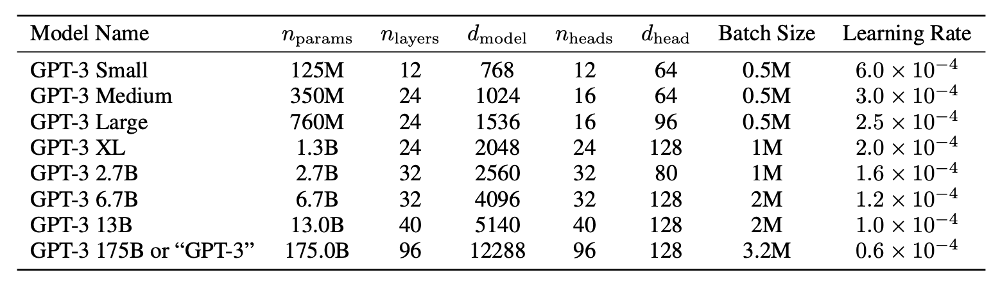

# Language Models are Few-Shot Learners

The paper from OpenAI that started it all. The after-effects of this work are still rapidly progressing. Let's dive in. 

The focus in NLP shifted from specialized models to task-agnostic systems for downstream applications. What started out as single layer representations, got converted to RNNs with multiple layers of representations and contextual states for stronger representations, and finally in the form of a transformer language model that seem to have amazing generalizing capabilities. 

When this paper was proposed, people were still training these models on labeled datasets, and with the unavailability of large scale general datasets outside task-specific ones, developing a large generalizable model was a challenge. Furthermore, the narrowness of the datasets can also inhibit the capabilities of the model. The authors of this paper argue that humans do not require such large scale datasets to perform these general capabilities, and quickly learn from only a few demonstrations. To counter these limitations, the previous works experimented with meta-learning and scaling the size of the language models. The authors note the smooth trend in improvement with scale, and they double down on this hypothesis.

The largest model trained prior to this had 17B parameters. In this paper, the authors trained a 175B parameter model!

## Approach, Model and Dataset

The pre-training of GPT follows a similar procedure to previous models at a larger scale. With this paper, they introduce new paradigms to evaluate/tune the model for in-context learning

1. Fine-tuning - Curating datasets for specific tasks for better performance. The authors mention that they don't use this paradigm with GPT-3 to test it's generalizing capabilities. 

2. Few-Shot - Model is given a few input demonstrations as part of the prompt to adapt to a new task

3. One-shot - Same as above, but only one example if provided

4. Zero-shot - Testing the capabilities of the model for new tasks without providing any new demonstrations 

The model architecture is same as GPT-2 that uses alternating dense and locally banded sparse attention patterns similar to Sparse Transformer. 

Many datasets for language models rapidly expanded and culminated into the Common Crawl dataset consisting of nearly a trillion words. The authors improved the dataset by

1. Filtering based on similarly to a range of high-quality reference corpora

2. Fuzzy deduplication at the document level to prevent redundancy and preserve the integrity of the validation set

3. Addition of high-quality reference corpora into the training mix

One concern people have with large datasets is the memorization of downstream test tasks. To reduce this effect, the authors tried to remove all benchmark test instances from the training set. They mention that due to a bug they did not do this perfectly, and there was contamination in some cases. 

## Training and Evaluation Details

Previous works showed that larger datasets perform better with larger batch sizes and a smaller learning rate. The authors use a gradient noise scale during training to guide the choice of the batch size. They use model parallelism (both intra-op and inter-op) to reduce the peak memory usage. All models were trained on V100 GPUs from Microsoft. 

With this experiment, a strong paradigm in this field of research has been established - **scaling both compute and model size has a power-law effect on the performance**. 

The authors test GPT-3 on multiple benchmarks carefully omitting cases that were a subset of the training dataset. They see that the few-shot setting achieves significantly higher performance that both one-shot and zero-shot. One-shot also shows improved performance with this model. in many cases, GPT-3 beat the SOTA model performance in multiple benchmarks. They test on generation, evaluation, reasoning and many other genres of tasks.

## Limitations

The authors noticed that GPT-3 tends to repeat itself and in some cases the few-shot does not perform much better than one-shot inference. In a more architectural sense, they note that GPT-3 does not specifically cater to tasks with bidirectional language flow requirements. They also mention that large models such as these reach the limits of their pre-training objective that itself does not place importance on some task-specific needs. That is, more useful language systems may be better due to goal-directed actions rather than just making predictions. Furthermore, language models are not grounded in other forms of information such as video and audio. 

Compared to humans, GPT-3 has much lower sample efficiency (it does meh with much much more samples seen during pre-training). Finally, both training and inference on such large models is very expensive and inconvenient. This has been changing in the recent times due to the advancements in RLHF and distillation techniques. 

The authors also mention the broader impact of this paper, and warn the readers about the potential misuses of language models. The biases in the training datasets like certain stereotypes can propagate into the model and also about the energy due to the rise in this domain. 

# Training Compute-optimal Large Language Models

The paper tries to answer an important dilemma in training language models - is it better to train bigger models that are potentially undertrained or train smaller models on more data? The authors noted the trends in model and tried to derive an empirical law for the trends observed. They note that the budget for model training is known apriori, and the training can only be done once, estimating the best hyperparameters is critical.

So, the question we are concerned with is - Given a fixed FLOPs budget, how should one trade-off model size and the number of training tokens?

There have been some previous works around this. A 10x increase in the computational budget should increase 5.5x while the number of training tokens should only increase 1.8x. However, the authors note that the previous works did not consider the variations in tokens, learning rate schedule and other hyper-parameters to better model the behaviors.

**Note.** This work is mainly for dense transformer architectures. They mention that there are orthogonal works like RAG and MoE that improve the models, but the motivation for this paper is to understand the behavior of dense transformers. 

## Approach

In the first method, the authors tried to vary the number of training steps for a fixed family of models. They obtained the minimum loss achieved for a given number of training FLOPs. Using the interpolants, they obtain a mapping from any FLOP count C to most efficient model size N and training tokens D. They obtain the relationship $$N_{opt} \propto C^{0.5}$$ and $$D_{opt} \propto C^{0.5}$$ contradicting previous results. 

In their second approach, they vary the model size for a fixed set of training FLOP counts and consider the final training loss for each point. It essentially answers the question for a given FLOP budget, what is the optimal parameter count. These are the IsoFLOPs experiments, and they obtain $$N_{opt} \propto C^{0.49}$$ and $$D_{opt} \propto C^{0.51}$$.

In the final approach, they modeled all the final losses considering the previous experiments, and considering a classical **risk decomposition**, they propose

$$
\hat L(N, D) = E + \frac{A}{N^\alpha} + \frac{B}{D^\beta}
$$

- The first term captures the loss for an ideal generative process on the data distribution and corresponds to the entropy of the natural text.

- The second term captures the fact that a perfectly trained transformer with $$N$$ parameters underperforms the ideal generative process. 

- The final term captures the fact that the transformer is not trained to convergence, as we only make a finite number of optimisation steps, on a sample of the dataset distribution.

To fit the empirical observations, they minimize a Huber loss on this formulation and also consider possible local minimas. Finally, they obtain the following results - 

| Approach                            | Coeff. $$ a $$ where $$ N_{\text{opt}} \propto C^a $$ | Coeff. $$ b $$ where $$ D_{\text{opt}} \propto C^b $$ |
| ----------------------------------- | ----------------------------------------------------- | ----------------------------------------------------- |
| 1. Minimum over training curves     | 0.50 (0.488, 0.502)                                   | 0.50 (0.501, 0.512)                                   |
| 2. IsoFLOP profiles                 | 0.49 (0.462, 0.534)                                   | 0.51 (0.483, 0.529)                                   |
| 3. Parametric modelling of the loss | 0.46 (0.454, 0.455)                                   | 0.54 (0.542, 0.543)                                   |
| Kaplan et al. (2020)                | 0.73                                                  | 0.27                                                  |

The key insights they obtain are - 

1. The current language models are considerably over-sized given the compute budges. 

2. The amount of training data that is projected to be needed is far beyond what is current used to train LLMs.

So the authors recommend that for a given training compute budget, smaller models should be trained on more tokens to achieve the most performant model. 

## Chinchilla

Considering the optimal hyperparameters they obtained, the authors trained a language model called *Chinchilla* as a competitor to Gopher. It is 4$$\times$$ smaller than Gopher, and similarly the memory footprint and inference costs are reduced too. They follow a mixed-precision training procedure. 

The results obtained are very impressive - Chinchilla significantly outperforms Gopher on many evaluation subsets. 

## Conclusion

The authors assert that scaling data instead of scaling models is the right way to obtain the best performance. We need to curate high-quality data - current models (e.g., GPT-3, MT-NLG) use only ~300B tokens, far below optimal recommendations (e.g., 1.5T tokens for 70B models).

They mention that such results and methodologies can also be extended to other kinds of models outside autoregressive language models.

Overall, this paper pushes towards an experimental based theoretical analysis of models and  establishes a framework for compute-optimal training, demonstrating that **equal scaling of parameters and tokens** maximizes model performance. Chinchilla validates this hypothesis, achieving SOTA results with reduced computational overhead. Future work must prioritize dataset quality and ethical considerations alongside scaling.

